# Database Design with ER-model

## Phases of Database Design Requirements Collection and Analysis
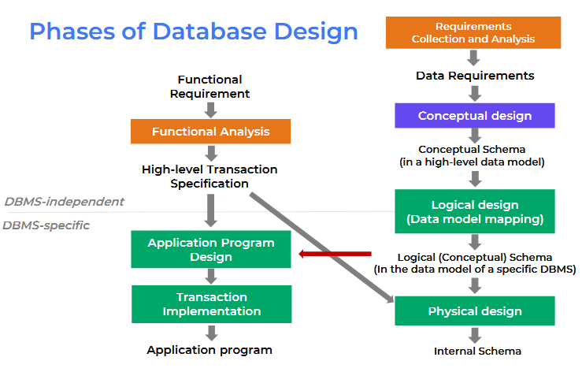
### 🔹 1) Requirements Collection and Analysis
* ขั้นตอนแรก → เก็บความต้องการของผู้ใช้ (User requirements)
* ถามคำถามว่า:
    * ต้องเก็บข้อมูลอะไรบ้าง?
    * ใครคือผู้ใช้ระบบ?
    * ต้องการรายงาน/ผลลัพธ์แบบไหน?
* หลังจากนั้นต้อง วิเคราะห์ ความต้องการเพื่อหาขอบเขตระบบ

👉 ตัวอย่าง: ถ้าสร้างระบบห้องสมุด → เก็บข้อมูล หนังสือ, สมาชิก, การยืมคืน

### 🔹 2) Conceptual Design
* แปลงความต้องการให้กลายเป็น โมเดลข้อมูลระดับสูง (High-level Data Model)
* ใช้ ER Diagram ในการออกแบบ
* อธิบายว่า:
    * มี Entity อะไรบ้าง (เช่น Student, Book)
    * แต่ละ Entity มี Attribute อะไรบ้าง (เช่น Name, Age)
    * Entity เชื่อมกันยังไง (Relationship เช่น Student “Borrow” Book)

👉 เน้น ภาพรวม เข้าใจง่ายสำหรับสื่อสารกับผู้ใช้

### 🔹 3) Logical Design (Data Model Mapping)
* นำ Conceptual Model → แปลงเป็น Logical Schema ที่สอดคล้องกับ DBMS ที่เลือกใช้
* ถ้าใช้ Relational DBMS → แปลง ER Diagram → ตาราง (Relations)
    * Entity → Table
    * Attribute → Column
    * Relationship → Foreign Key

👉 ตัวอย่าง:
ERD: Student — Borrow — Book
→ Logical Schema: ตาราง Student, Book, Borrow

### 🔹 4) Physical Design
* ระดับนี้คือ “จะเก็บข้อมูลจริงยังไงในคอมพิวเตอร์”
* กำหนดว่า:
    * ใช้ Index อะไร
    * เก็บไฟล์แบบไหน (Heap, Hash, B+ Tree)
    * กำหนดขนาด Data type เพื่อ optimize
* เป็นงานของ DBA และ System Engineer

👉 ผู้ใช้ทั่วไปจะไม่เห็นส่วนนี้ แต่สำคัญต่อประสิทธิภาพ

### 🔹 5) Functional Analysis
* ขั้นตอนนี้เน้นที่ การทำงาน (Functionality) ของระบบ ไม่ใช่แค่ข้อมูล
* ประกอบด้วย:
    * Functional Requirement → ระบบต้องทำอะไรบ้าง เช่น เพิ่ม/ลบ/ค้นหา/แก้ไข
    * High-level Transaction Specification → นิยามธุรกรรมหลัก ๆ เช่น “ยืมหนังสือ”, “คืนหนังสือ”
    * Application Program Design → ออกแบบโปรแกรม/หน้าจอที่ผู้ใช้จะเห็น
    * Transaction Implementation → การเขียนโค้ดจริงเชื่อมกับฐานข้อมูล

👉 เป็นการเชื่อมโยงระหว่าง ข้อมูล (Data) และ การใช้งานจริง (Process)

### 📌 สรุปสั้น ๆ ของ Phases
1. Requirement Analysis → เก็บความต้องการ
2. Conceptual Design → ER Model
3. Logical Design → แปลงเป็น Schema ของ DBMS
4. Physical Design → กำหนดวิธีเก็บจริงใน Disk
5. Functional Analysis → ออกแบบธุรกรรมและโปรแกรมที่ใช้ฐานข้อมูล

---

## Entity Relational Data Model
### 🔹 แนวคิดหลักของ ER-Model
ER-Model ใช้ในการ “แปลงความต้องการของผู้ใช้” ให้ออกมาเป็น แผนภาพ (ER Diagram)
เพื่อให้เข้าใจง่ายก่อนจะเอาไปสร้าง Database จริง

#### มันประกอบด้วย 3 องค์ประกอบหลัก:
##### 1) Entity (เอนทิตี)
* คือ **สิ่งที่เราสนใจจะเก็บข้อมูล**
* อาจเป็นสิ่งที่มีตัวตนจริง (Physical) → เช่น นักเรียน, หนังสือ, รถยนต์
* หรือสิ่งที่เป็นนามธรรม (Conceptual) → เช่น รายวิชา, การสั่งซื้อ, งานวิจัย
* ถ้าเป็น Logical มันคือ Table

👉 ใน ER Diagram จะแทนด้วย สี่เหลี่ยมผืนผ้า

##### 2) Attribute (คุณลักษณะ)
* คือ **คุณสมบัติของ Entity**
* เช่น Entity = Student → Attribute = StudentID, Name, Age
* ค่า (Value) ของ Attribute คือข้อมูลจริงที่ถูกเก็บใน Database
* ถ้าเป็น Logical มันคือ Column

👉 ใน ER Diagram จะแทนด้วย วงรี เชื่อมกับ Entity

##### 3) Relationship (ความสัมพันธ์)
* คือ **ความเชื่อมโยงระหว่าง Entity**
* ตัวอย่าง:
    * Student **“เรียน”** Course
    * Customer **“สั่งซื้อ”** Product
* ความสัมพันธ์อาจเป็น 1:1, 1:N, หรือ N:M
* ต้องใช้เป็น Verb เพราะ Relationship บอก “การกระทำ” หรือ “ความสัมพันธ์”

👉 ใน ER Diagram จะแทนด้วย รูปสี่เหลี่ยมข้าวหลามตัด (Diamond)

### 📌 สรุปภาพรวม ER-Model
* Entity = สิ่งที่ต้องเก็บ
* Attribute = ข้อมูลรายละเอียดของสิ่งนั้น
* Relationship = การเชื่อมโยงกันของสิ่งต่าง ๆ

---

## Entities and Attributes
### 🔹 ความหมายของ Entity และ Attribute
#### Entity (เอนทิตี)
* คือสิ่งที่เราต้องการเก็บข้อมูลในฐานข้อมูล
* อาจเป็นสิ่งที่มีอยู่จริง (Physical) เช่น นักเรียน, หนังสือ, รถยนต์
* หรือสิ่งที่เป็นนามธรรม (Conceptual) เช่น คำสั่งซื้อ, หลักสูตร, การชำระเงิน
* ใน ER Diagram แทนด้วย สี่เหลี่ยมผืนผ้า

👉 เช่น:
* Entity = Student

#### Attribute (คุณลักษณะ)
* คือ “รายละเอียด/คุณสมบัติ” ของ Entity
* ทำให้เรารู้จัก Entity นั้น ๆ ได้ชัดเจน
* ใน ER Diagram แทนด้วย วงรี

👉 เช่น:
* Entity = Student
* Attribute = StudentID, Name, Age

### 🔹 Attribute & Attribute Value
* Attribute = ชื่อคุณสมบัติ (เหมือน “ช่อง” ในตาราง)
* Attribute Value = ค่าของคุณสมบัติ (ข้อมูลจริงที่บันทึก)

👉 ตัวอย่าง:
Entity: Student
* Attribute: StudentID, Name, Major
* Attribute Value:
    * (663020555-8, “Pichai Wannarat”, “AI”)
    * (663020222-5, “Supansa Chaiyaporn”, “CS”)

### 📌 สรุปสั้น ๆ
* **Entity** = สิ่งที่ต้องการเก็บข้อมูล
* **Attribute** = คุณสมบัติของสิ่งนั้น
* **Attribute** Value = ค่าจริงที่บันทึกลงไป

---

## Type of Attributes
### 🔹 1) Atomic and Composite Attributes
* Atomic (Simple) Attribute
    * Attribute ที่ไม่สามารถแบ่งย่อยได้อีก
    * เช่น: FirstName, Age, StudentID
    * 👉 คิดว่าเป็น “ข้อมูลพื้นฐานที่แยกไม่ได้”

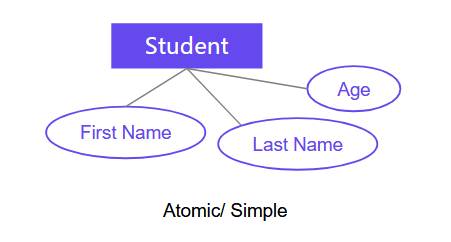
* Composite Attribute
    * Attribute ที่สามารถแบ่งออกเป็น Sub-attribute ได้
    * เช่น: Address → แยกเป็น Street, District, Province, ZipCode
    * 👉 คิดว่าเป็น “กล่องใหญ่” ที่มีรายละเอียดข้างในอีก

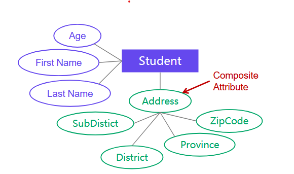

### 🔹 2) Single-valued and Multi-valued Attributes
* Single-valued Attribute
    * Attribute ที่มีค่าเดียวต่อ 1 Entity
    * เช่น: Age ของ Student = 20 (มีค่าเดียว)
* Multi-valued Attribute
    * Attribute ที่มีได้หลายค่า
    * เช่น: PhoneNo ของ Student = {043-000-2581, 09-5888-4124}
    * 👉 หนึ่งคน อาจมีเบอร์โทรหลายเบอร์

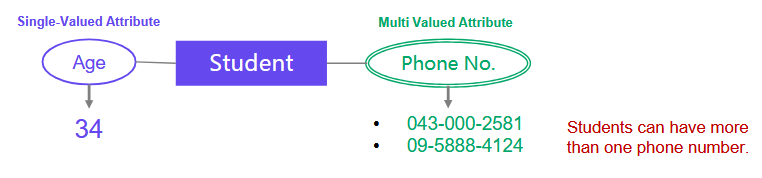

### 🔹 3) Stored vs Derived Attributes
* Stored Attribute
    * ค่าเก็บไว้ตรง ๆ ใน Database
    * เช่น: DateOfBirth, Name
* Derived Attribute
    * ค่าไม่ได้เก็บตรง ๆ แต่ “คำนวณได้จาก Attribute อื่น”
    * เช่น: Age = CurrentDate – DateOfBirth
    * 👉 ใน ER Diagram มักเขียนด้วย เส้นปะ

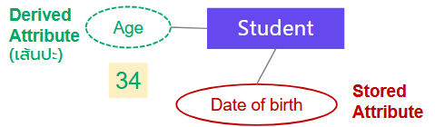

### 📌 สรุปสั้น ๆ
* **Atomic vs Composite** → ย่อยได้หรือไม่ได้
* **Single vs Multi** → หนึ่งค่าหรือหลายค่า
* **Stored vs Derived** → เก็บตรง ๆ หรือคำนวณได้จากข้อมูลอื่น

---

## Key Attribute & Null Value
### 🔹 Key Attribute
* Key Attribute คือ Attribute ที่ใช้ระบุ Entity แต่ละตัวไม่ให้ซ้ำกัน
* คุณสมบัติ:
    * Unique → ค่าต้องไม่ซ้ำกัน
    * Not Null → ต้องมีค่าเสมอ (ห้ามว่าง)
* ตัวอย่าง:
    * Student → StudentID
    * Book → ISBN
    * Employee → EmployeeID

👉 ใน ER Diagram มักขีดเส้นใต้ (underline) Attribute ที่เป็น Key เช่น StudentID

### 🔹 Null Value
* Null = ไม่มีค่า หรือ ไม่ทราบค่า
* ใช้ในกรณี:
    * ข้อมูลไม่ทราบจริง ๆ (Unknown) เช่น ยังไม่รู้ที่อยู่ของลูกค้า
    * ข้อมูลไม่เกี่ยวข้อง (Not Applicable) เช่น คนไม่มีเบอร์บ้าน → ค่า PhoneHome = NULL
* หมายเหตุ:
    * NULL ≠ 0 และ NULL ≠ "" (ว่างเปล่า)
    * เป็น “ไม่มีค่า” จริง ๆ

👉 ตัวอย่าง:
| Name | Subject | Score |
| ---- | ------- | ----- |
| Many | Maths   | 80    |
| Many | Science | NULL  |
| Tony | Maths   | 0     |
* Tony ได้ 0 → มีค่าแต่สอบตก
* Many วิชา Science = NULL → ไม่ทราบคะแนน (ยังไม่สอบ หรือไม่มีข้อมูล)

### 📌 สรุปสั้น ๆ
* Key Attribute = ใช้ระบุ Entity ไม่ให้ซ้ำ (Unique + Not Null)
* Null Value = ไม่มีค่า (ไม่ทราบ/ไม่เกี่ยวข้อง) และไม่เหมือนกับ 0 หรือค่าว่าง

---

## Entity Type
### 🔹 1) Regular Entity Type
* เรียกอีกชื่อว่า Strong Entity
* คือ Entity ที่มี Key Attribute ของตัวเอง → ระบุเอกลักษณ์ได้
* ไม่ต้องพึ่งพา Entity อื่น
* ตัวอย่าง:
    * Student(StudentID, Name, Age) → StudentID เป็น Key
    * Book(BookID, Title, Author) → BookID เป็น Key

👉 ใน ER Diagram จะแทนด้วย สี่เหลี่ยมผืนผ้าเส้นทึบ

### 🔹 2) Weak Entity Type
* คือ Entity ที่ ไม่มี Key Attribute ของตัวเอง
* ต้องอาศัย Owner Entity (Strong Entity) มาช่วยระบุ
* จะมีความสัมพันธ์พิเศษที่เรียกว่า Identifying Relationship
* ตัวอย่าง:
    * Payment(Date, Amount) → ไม่มี Key ของตัวเอง → ต้องอิงกับ OrderID (จาก Entity Order)
    * Dependent(Name, Age) → ต้องอิงกับ Employee (EmployeeID เป็นเจ้าของ)

👉 ใน ER Diagram:
* Weak Entity = สี่เหลี่ยมผืนผ้าเส้นคู่
* Identifying Relationship = ข้าวหลามตัดเส้นคู่

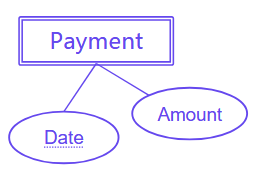

### 🔹 3) Entity Sets, Keys, Value Set
* Entity Type → คือ “ชนิด” ของ Entity เช่น Student, Book
* Entity Set → คือ “กลุ่มของ Entity ที่เป็นชนิดเดียวกัน”
    * เช่น Entity Type = Student
    * Entity Set = {Student(1, Somchai, 20), Student(2, Suda, 19)}

* Key Attribute → Attribute ที่ใช้ระบุ Entity แต่ละตัวไม่ให้ซ้ำ
* Value Set (Domain) → คือค่าที่ Attribute นั้น ๆ จะเก็บได้
    * เช่น Attribute = Age → Value Set = {1, 2, 3, …, 150}

### 📌 สรุปสั้น ๆ
* Regular Entity = มี Key ของตัวเอง → ระบุเอกลักษณ์ได้
* Weak Entity = ไม่มี Key ของตัวเอง → ต้องพึ่ง Strong Entity
* Entity Set = กลุ่มของ Entity ที่เป็นชนิดเดียวกัน
* Value Set = ชุดค่าที่ Attribute รับได้

---

## Relationships

### 🔹 ความหมายของ Relationship
* Relationship = ความสัมพันธ์ระหว่าง Entities สองตัวหรือมากกว่า
* ใช้เพื่ออธิบายว่า Entity ต่าง ๆ เชื่อมโยงกันยังไง
* ตัวอย่าง:
    * Student **enrolls** in Course
    * Customer **places** Order
    * Employee **works** in Department

👉 ใน ER Diagram → ใช้ สี่เหลี่ยมข้าวหลามตัด (Diamond) แทน Relationship

### 🔹 Degree of Relationship Sets (ระดับของความสัมพันธ์)
#### 1) Binary Relationship Set
* ความสัมพันธ์ระหว่าง 2 Entity Set
* เป็นแบบที่พบบ่อยที่สุด
* ตัวอย่าง:
    * Student — Borrow — Book
    * Employee — Works_in — Department

👉 มี 2 ฝั่งชัดเจน (N:M, 1:N, 1:1)

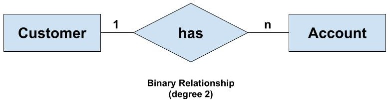

#### 2) Ternary Relationship Set
* ความสัมพันธ์ระหว่าง 3 Entity Set
* ตัวอย่าง:
    * Supplier — Supplies — Product — To Warehouse
    * Doctor — Treats — Patient — With Medicine
* ต้องระวังว่า Ternary ≠ 3 Binary แยกกัน เพราะ ternary อธิบายความสัมพันธ์ พร้อมกัน 3 ฝั่ง

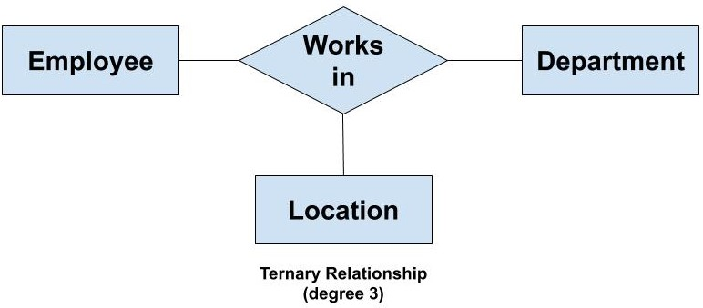

#### 3) Recursive / Unary Relationship
* ความสัมพันธ์ Entity ตัวเดียวกัน เชื่อมกับตัวเอง
* ตัวอย่าง:
    * Employee — supervises — Employee
    * Student — buddy_of — Student
* ใช้เมื่อ Entity ชนิดเดียวกันมีบทบาทต่างกัน

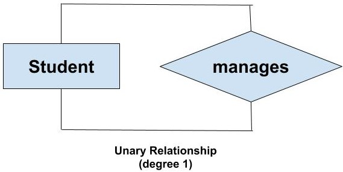

### 📌 สรุปสั้น ๆ
* Relationship = ความเชื่อมโยงระหว่าง Entity
* Binary = 2 Entity → พบมากที่สุด
* Ternary = 3 Entity → อธิบายความสัมพันธ์ที่ซับซ้อน
* Recursive/Unary = Entity เดียวกันมีความสัมพันธ์กับตัวเอง

---

## Mapping Constraints
### 🔹 Mapping Cardinalities (Cardinality Ratios)
บอกว่า Entity หนึ่งสามารถเชื่อมกับ Entity อื่นได้มากน้อยแค่ไหน

#### 1) 1:1 Relationship (One to One)
* Entity A 1 ตัว → จับคู่กับ Entity B ได้อย่างมาก 1 ตัวเท่านั้น
* ตัวอย่าง:
    * User ↔ Profile (ผู้ใช้ 1 คนมี 1 โปรไฟล์เท่านั้น)

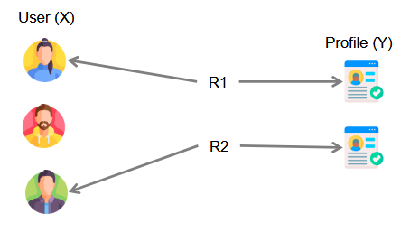

#### 2) 1:N Relationship (One to Many)
* Entity A 1 ตัว → จับคู่กับ Entity B ได้หลายตัว
* แต่ Entity B 1 ตัว → จับคู่กับ Entity A ได้เพียง 1 ตัว
* ตัวอย่าง:
    * Student ↔ FoodOrder
    * นักเรียน 1 คนสั่งอาหารได้หลายเมนู แต่เมนู 1 รายการจะเป็นของนักเรียน 1 คนเท่านั้น

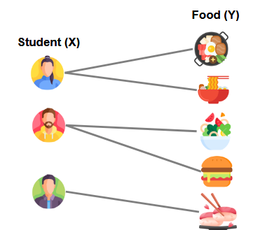

#### 3) N:M Relationship (Many to Many)
* Entity A 1 ตัว → จับคู่กับ Entity B ได้หลายตัว
* และ Entity B 1 ตัว → จับคู่กับ Entity A ได้หลายตัว
* ตัวอย่าง:
    * Student ↔ Course
    * นักเรียนหลายคนเรียนวิชาเดียวกันได้ และ 1 วิชาก็มีนักเรียนหลายคนลงทะเบียนได้

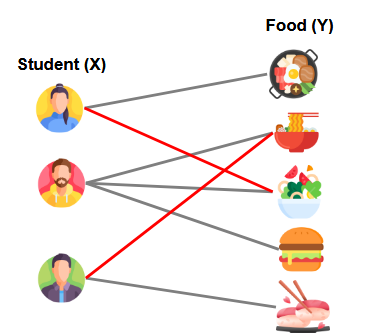

### 🔹 Participation Constraints
บอกว่า Entity ทุกตัวจำเป็นต้องมีความสัมพันธ์หรือไม่

#### 1) Partial Participation (บางส่วน)
* มีบาง Entity เท่านั้นที่เข้าร่วมใน Relationship
* ตัวอย่าง:
    * Customer ↔ Booking
    * ลูกค้าบางคนอาจไม่เคยจอง → การเข้าร่วมเป็นบางส่วน (Partial)

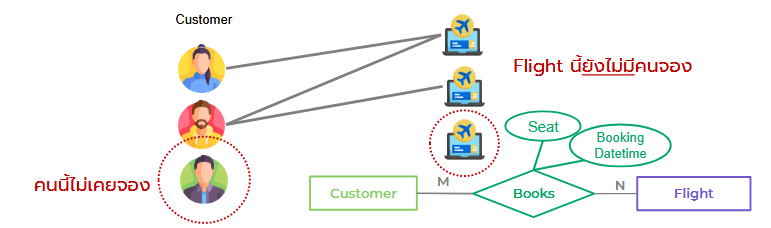
#### 2) Total Participation (ทั้งหมด)
* ทุก Entity ใน Set ต้องมีความสัมพันธ์อย่างน้อย 1 ครั้ง
* ตัวอย่าง:
    * Student ↔ Faculty
    * นักเรียนทุกคนต้องสังกัดคณะ → ดังนั้น Student ต้องมีความสัมพันธ์กับ Faculty เสมอ

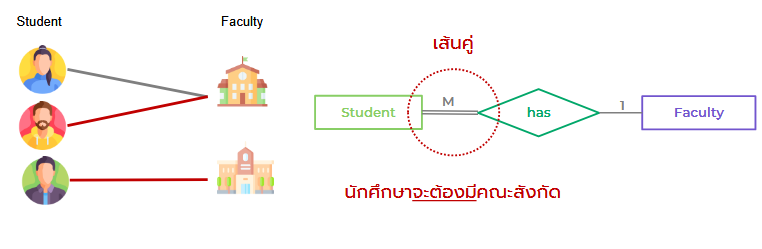

### 📌 สรุปสั้น ๆ
* Cardinality = กำหนดจำนวน (1:1, 1:N, N:M)
* Participation = กำหนดว่าจำเป็นต้องมีความสัมพันธ์หรือไม่ (Partial vs Total)

---
## Symbols in ER-Diagram
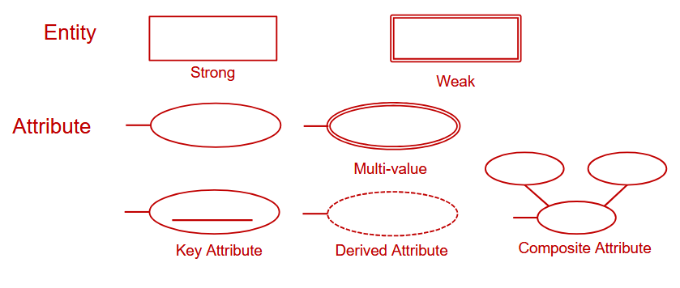
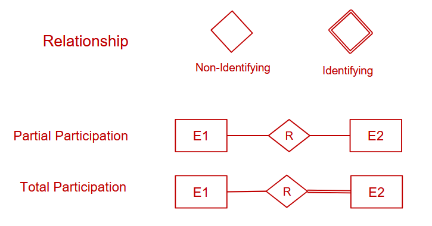

### 🔹 Entity
* Strong Entity (Regular Entity)
    * วาดด้วย สี่เหลี่ยมเส้นทึบ
    * เช่น `Student`, `Book`
* Weak Entity
    * วาดด้วย สี่เหลี่ยมเส้นคู่
    * เช่น `Payment` (ขึ้นกับ `Order`)
    * ต้องมี Identifying Relationship มาผูกกับ Strong Entity
### 🔹 Attribute
* Key Attribute
    * วาดด้วย วงรีและมีขีดเส้นใต้
    * เช่น `StudentID`
* Composite Attribute
    * วาดวงรีหลัก → แตกแขนงย่อยไปยัง Sub-Attribute
    * เช่น `Address` → {Street, District, Province, ZipCode}
* Derived Attribute
    * วาดวงรีด้วย เส้นปะ
    * เช่น `Age` (คำนวณจาก DateOfBirth)
* Multi-valued Attribute
    * วาดวงรี เส้นคู่
    * เช่น `PhoneNo` (1 คนมีหลายเบอร์ได้)

### 🔹 Relationship
* Identifying Relationship
    * ใช้ สี่เหลี่ยมข้าวหลามตัดเส้นคู่
    * เชื่อม Weak Entity กับ Owner Entity
* Non-identifying Relationship (ปกติ)
    * ใช้ สี่เหลี่ยมข้าวหลามตัดเส้นเดี่ยว
* Participation Constraints
    * Total Participation → ใช้เส้นคู่เชื่อม Entity → Relationship
    * Partial Participation → ใช้เส้นเดี่ยวเชื่อม

### 📌 สรุปภาพรวมสัญลักษณ์ ERD
* Entity → สี่เหลี่ยม (ทึบ = Strong, คู่ = Weak)
* Attribute → วงรี (เส้นปกติ = ปกติ, เส้นใต้ = Key, เส้นคู่ = Multi-valued, เส้นปะ = Derived, แตกแขนง = Composite)
* Relationship → ข้าวหลามตัด (ปกติ = เส้นเดี่ยว, Identifying = เส้นคู่, Participation = เดี่ยว/คู่ตามข้อกำหนด)