# Database system concept and Architecture

## Data Models, Schemas, and Instance

### Data Model คืออะไร?
* คือ แบบจำลอง (Model) ที่ใช้บอกว่า “ข้อมูลในฐานข้อมูลมีหน้าตายังไง และเชื่อมโยงกันอย่างไร”
* จะอธิบาย โครงสร้างข้อมูล (Structure) เช่น ชนิดข้อมูล, ความสัมพันธ์, ข้อจำกัด
* เป็นเครื่องมือสำคัญในการ ออกแบบฐานข้อมูล ให้สื่อสารกันเข้าใจได้ง่าย

👉 เปรียบเทียบง่าย ๆ: **Data Model** = แผนผังบ้าน ที่บอกว่าจะมีห้องอะไรบ้าง เชื่อมกันยังไง ก่อนจะลงมือสร้างบ้านจริง

### 🔹 Categories of Data Models (หมวดหมู่ของ Data Model)
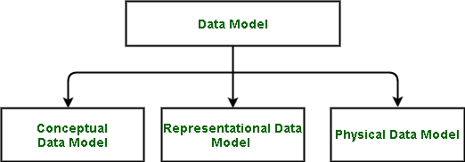
#### 1. High Level / Conceptual Data Model
* เป็นมุมมองสูง ๆ ใกล้เคียงกับการคิดของผู้ใช้ทั่วไป
* ใช้เพื่อสื่อสารความต้องการระหว่างผู้ใช้ ↔ นักออกแบบ
* ตัวอย่าง: ER Diagram (Entity-Relationship)
    * Entity = สิ่งที่เราสนใจ (เช่น นักเรียน, วิชา)
    * Attribute = คุณสมบัติ (เช่น ชื่อ, อายุ)
    * Relationship = ความสัมพันธ์ (เช่น นักเรียน “ลงทะเบียนเรียน” วิชา)

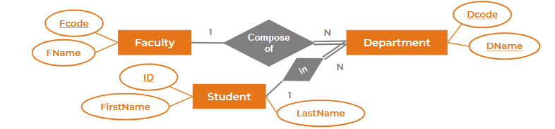
#### 2. Representational / Logical (Implementation) Data Model
* เป็นขั้นที่ลงรายละเอียดมากขึ้น → ใกล้เคียงกับการใช้งานจริงบนคอมพิวเตอร์
* ใช้บอกว่า “ข้อมูลจะเก็บเป็นตารางยังไง”
* ตัวอย่าง: Relational Model (ตารางแถว-คอลัมน์), มี Primary Key, Foreign Key
* End user อาจยังพอเข้าใจ แต่ Programmer ใช้บ่อยที่สุด


#### 3. Low Level / Physical Data Model
* มุมมองล่างสุด → เน้น “ข้อมูลถูกเก็บในเครื่องคอมพิวเตอร์ยังไง”
* เช่น ใช้ Index แบบไหน, เก็บบนฮาร์ดดิสก์แบบ sequential หรือ hashed
* เป็นเรื่องของ DBA / ผู้เชี่ยวชาญระบบ มากกว่าผู้ใช้ทั่วไป

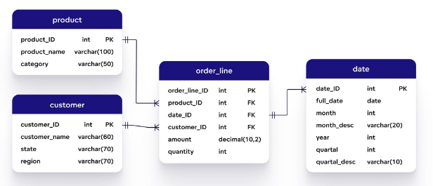

### 🔹 Comparison: Conceptual vs Logical vs Physical
|ระดับ|Conceptual|Logical|Physical|
|---|---|---|---|
|มุมมอง|ภาพรวม, เน้นสิ่งที่ต้องการ|โครงสร้างเชิงตรรกะ|การเก็บจริงในฮาร์ดแวร์|
|ใช้โดย|ผู้ใช้, นักออกแบบ|Programmer, System Analyst|DBA, System Engineer
|ตัวอย่าง|ER Diagram|Relational Model (ตาราง, PK, FK)|Index, File organization|
|เทคโนโลยี|ไม่ขึ้นกับเทคโนโลยี|ไม่ขึ้นกับเทคโนโลยี|ขึ้นกับเทคโนโลยีจริง (DBMS/Storage)|

### 📌 สรุป
* Data Model = แบบจำลองข้อมูลที่ใช้ในการออกแบบฐานข้อมูล
* มี 3 ระดับ: Conceptual (เข้าใจง่าย) → Logical (โครงสร้างชัดเจน) → Physical (วิธีเก็บจริง)

---

## Schemas, Instances, and Database State

### 🔹 1) Database Schema (สคีมา)
* Schema = “พิมพ์เขียว (Blueprint)” ของฐานข้อมูล
* อธิบายว่า มีตารางอะไรบ้าง, แต่ละตารางมีคอลัมน์อะไร, ความสัมพันธ์กันยังไง, มีข้อจำกัดอะไร
* Schema จะถูกนิยามตอนออกแบบ และ ไม่ค่อยเปลี่ยนบ่อย

👉 เปรียบเทียบง่าย ๆ: Schema = แปลนบ้าน ที่บอกว่ามีห้องอะไรบ้าง วางยังไง

### 🔹 2) Schema Diagram (ผังสคีมา)
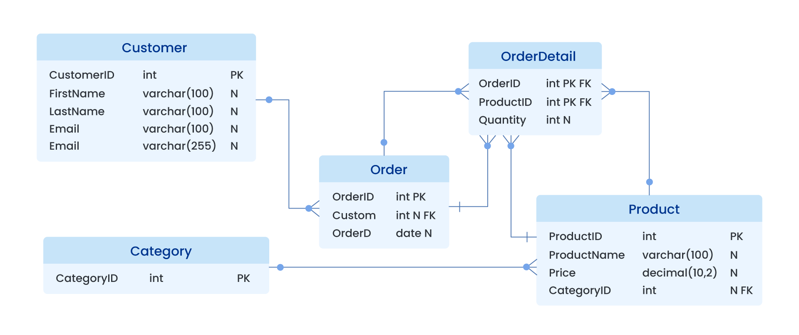
* คือการ วาดภาพ โครงสร้างของฐานข้อมูลออกมาให้เห็นชัดเจน
* แสดงชื่อ ตาราง, คอลัมน์, คีย์, ความสัมพันธ์
* แต่ ไม่ได้แสดงข้อมูลจริง
* ตัวอย่าง: ER Diagram ที่วาดว่า User → Borrow → Book

👉 Schema Diagram = แผนผัง ที่ทำให้เรามองเห็นโครงสร้างฐานข้อมูลได้ง่าย

### 🔹 3) Database State / Instances (Snapshot)
* Database State (หรือ Instance/Snapshot) = ข้อมูลที่อยู่ในฐานข้อมูล ณ เวลาใดเวลาหนึ่ง
* ข้อมูลเหล่านี้ เปลี่ยนตลอดเวลา เพราะผู้ใช้เพิ่ม/แก้ไข/ลบข้อมูล
* ตัวอย่าง:
    * ตอนนี้ในตาราง Student มี 100 คน
    * พรุ่งนี้มีเพิ่มมาอีก 5 คน → Database State เปลี่ยน

👉 เปรียบเทียบง่าย ๆ: State = ของที่อยู่ในบ้านจริง ๆ ตอนนี้ (เฟอร์นิเจอร์อาจย้ายได้)

### 🔹 4) Distinction between Schema and State
* Schema = โครงสร้าง (Blueprint) → คงที่ ไม่เปลี่ยนบ่อย
* State (Instance) = ข้อมูลจริง (Snapshot) → เปลี่ยนได้ตลอดเวลา

### ตัวอย่าง “ตาราง Student”
* Schema:
    * Student(StudentID, Name, Age)
* State (ปัจจุบัน):
    * (1, “Somchai”, 20)
    * (2, “Suda”, 19)

👉 Schema = โครงสร้างตาราง
👉 State = ข้อมูลที่อยู่ในตารางตอนนี้

### 📌 สรุปสั้น ๆ
* Database Schema = โครงสร้าง (แปลน)
* Schema Diagram = แผนภาพที่แสดงโครงสร้าง
* Database State (Instance) = ข้อมูลจริง ณ ขณะใดขณะหนึ่ง
* แตกต่างกัน → Schema คงที่, State เปลี่ยนได้ตลอดเวลา

---

## Three-Schema Architecture and Data Independence
### 🔹 1) Three Level Architecture (ANSI/SPARC)
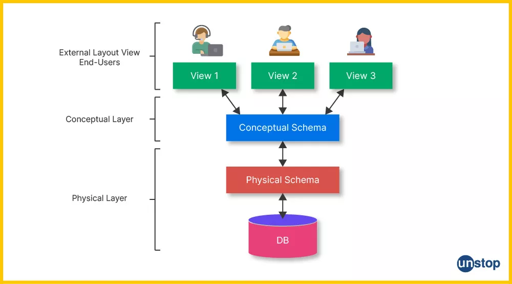
สถาปัตยกรรมฐานข้อมูลแบ่งเป็น 3 ระดับ เพื่อให้ผู้ใช้มองเห็นในมุมที่ต่างกัน และซ่อนรายละเอียดที่ไม่จำเป็น
1. External Level (View Level) → มุมมองของผู้ใช้
2. Conceptual Level (Logical Level) → มุมมองรวม (ทั้งองค์กร)
3. Internal Level (Physical Level) → มุมมองจริงในการเก็บในเครื่อง

👉 หลักการสำคัญคือ การซ่อนรายละเอียด (Abstraction) เช่น ผู้ใช้ไม่ต้องรู้ว่าข้อมูลเก็บบน Hard Disk ยังไง แค่เรียกใช้ผ่าน View ก็พอ

### 🔹 2) External Level (Views)
* คือ มุมมองของผู้ใช้แต่ละกลุ่ม
* แต่ละกลุ่มอาจเห็นข้อมูลไม่เหมือนกัน (ขึ้นกับสิทธิ์)
* ตัวอย่าง:
    * นักศึกษา → เห็นผลการเรียนตัวเอง
    * อาจารย์ → เห็นผลการเรียนของนักศึกษาที่สอน
    * ผู้บริหาร → เห็นสรุปเกรดเฉลี่ยทั้งคณะ

👉 External Level = “หน้าจอที่ผู้ใช้มองเห็น”

### 🔹 3) Conceptual Level
* คือ ภาพรวมทั้งหมดของฐานข้อมูล
* อธิบายว่า Database มีตารางอะไร, ความสัมพันธ์ยังไง, ข้อจำกัดอะไรบ้าง
* ไม่ขึ้นกับฮาร์ดแวร์หรือการเก็บจริง ๆ
* ตัวอย่าง: ER Diagram ของทั้งมหาวิทยาลัย (Student, Course, Instructor, Registration)

👉 Conceptual Level = “แบบแปลนรวมของทั้งอาคาร”

### 🔹 4) Internal Level
* คือ มุมมองต่ำสุด → เน้นการเก็บข้อมูลจริงในเครื่อง
* อธิบายว่าไฟล์เก็บยังไง, ใช้ Index อะไร, เก็บแบบ Sequential, Hash, B-Tree
* ผู้ใช้ทั่วไปไม่เห็นระดับนี้ มีแต่ DBA ที่ดูแล

👉 Internal Level = “โครงสร้างการเดินสายไฟ-น้ำในตึก” (ผู้ใช้ทั่วไปไม่เห็น แต่จำเป็นต่อการทำงาน)


### 🔹 5) Mappings between levels (การแม็ประหว่างแต่ละระดับ)
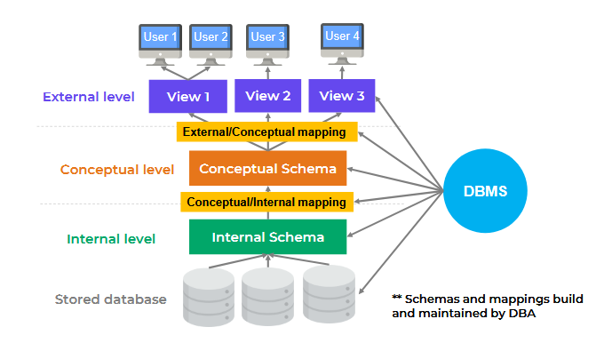
DBMS ต้องมีกระบวนการแปลงคำสั่ง/ผลลัพธ์ ระหว่างระดับต่าง ๆ
* External/Conceptual Mapping
    * แปลง View ของผู้ใช้ → ให้ตรงกับ Conceptual Schema
    * เช่น เวลา User สั่ง Query “ดูรายวิชา” → DBMS จะไปแม็ปกับ Conceptual Schema เพื่อหาตารางที่เกี่ยวข้อง

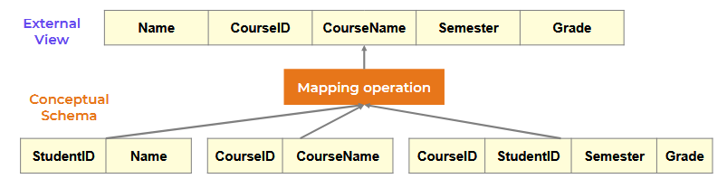

* Conceptual/Internal Mapping
    * แปลงจาก Conceptual Schema → วิธีเก็บจริง (Internal)
    * เช่น Conceptual มีตาราง Student → DBMS จะแม็ปไปยังไฟล์จริงและ Index ที่เก็บใน Disk

### 🔹 6) Data Independence (ความเป็นอิสระของข้อมูล)
หมายถึงความสามารถในการ เปลี่ยน Schema ในระดับหนึ่ง โดยไม่กระทบระดับที่สูงกว่า
* **Logical Data Independence**
    * เปลี่ยน Conceptual Schema ได้ โดยไม่กระทบ External View
    * เช่น เพิ่มคอลัมน์ใหม่ในตาราง Student → View ของนักศึกษายังใช้งานได้ตามเดิม

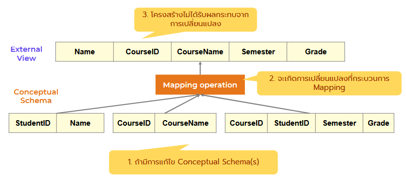

* **Physical Data Independence**
    * เปลี่ยน Internal Schema ได้ โดยไม่กระทบ Conceptual Schema
    * เช่น เปลี่ยนจากเก็บ Sequential → เก็บแบบ Index → User และ Programmer ยังใช้ Query เหมือนเดิม

**👉 สรุปง่าย ๆ:**
* Logical Independence = โครงสร้างเปลี่ยน ผู้ใช้ยังใช้เหมือนเดิม
* Physical Independence = วิธีเก็บเปลี่ยน ผู้ใช้ไม่รู้สึกถึงความต่าง

### 📌 สรุปภาพรวม
* 3 ระดับ (External, Conceptual, Internal) = ซ่อนรายละเอียดทีละชั้น
* Mapping = DBMS แปลคำสั่งจากผู้ใช้ → ลงไปยังข้อมูลจริง
* Data Independence = สามารถเปลี่ยนแปลงบางระดับ โดยไม่กระทบอีกระดับ

---

## Database Language and Interfaces

### 🔹 1) Data Definition Language (DDL)
* ภาษาที่ใช้ นิยามโครงสร้างของฐานข้อมูล (Schema)
* ใครใช้: DBA, Database Designer
* ตัวอย่างคำสั่ง:
``` sql
CREATE TABLE Student (
    StudentID INT PRIMARY KEY,
    Name VARCHAR(50),
    Age INT
);

ALTER TABLE Student ADD Email VARCHAR(100);

DROP TABLE Student;
```

👉 DDL = “เขียนพิมพ์เขียว” ของฐานข้อมูล

### 🔹 2) Data Manipulation Language (DML)
* ภาษาที่ใช้ จัดการข้อมูลจริง (Data State) เช่น เพิ่ม, ลบ, แก้ไข, ดึงข้อมูล
* ใครใช้: End User, Programmer
* ตัวอย่างคำสั่ง:
``` sql
INSERT INTO Student VALUES (1, 'Somchai', 20);

UPDATE Student SET Age = 21 WHERE StudentID = 1;

DELETE FROM Student WHERE StudentID = 1;

SELECT * FROM Student;
```
👉 DML = “การทำงานจริงกับข้อมูล”

### 📌 สรุปภาพรวม
* **DDL** → นิยามโครงสร้างฐานข้อมูล (พิมพ์เขียว)
* **DML** → จัดการข้อมูลจริง (เพิ่ม/ลบ/แก้ไข/ดึง)

---

## The Database System Environment DBMS Component Modules

### 🔹 1) DBMS Component Modules

DBMS ไม่ได้มีแค่ตัวจัดเก็บข้อมูล แต่มี “โมดูล” ย่อย ๆ ที่ช่วยทำงานหลายด้าน เช่น
1. Storage Manager
    * จัดการไฟล์จริงใน Disk → เก็บและดึงข้อมูลจากหน่วยความจำสำรอง (Hard disk, SSD)
    * ดูแล Index, File organization
2. Query Processor
    * แปลง SQL ของผู้ใช้ให้กลายเป็น “แผนการทำงาน” (Execution Plan)
    * ทำ Optimization ให้ Query ทำงานเร็วที่สุด
3. Transaction Manager
    * ดูแลเรื่อง ACID (Atomicity, Consistency, Isolation, Durability)
    * ให้หลายคนใช้งานฐานข้อมูลพร้อมกันได้โดยข้อมูลไม่ขัดแย้งกัน
4. Concurrency Control Manager
    * ป้องกันปัญหาเวลามีหลาย User เขียน/อ่านข้อมูลพร้อมกัน เช่น Deadlock, Lost Update
5. Recovery Manager
    * กู้ข้อมูลกลับมาหลังระบบพัง (Crash Recovery)

👉 รวม ๆ แล้ว DBMS คือ ชุดโปรแกรมย่อย ที่ทำงานร่วมกัน เพื่อให้การเก็บ/ดึง/แก้ไขข้อมูลเป็นไปอย่างปลอดภัยและมีประสิทธิภาพ

#### 🔹 2) Data Dictionary (Metadata Repository)
* Data Dictionary = “สมุดบันทึกเกี่ยวกับข้อมูล”
* ไม่ได้เก็บข้อมูลจริง แต่เก็บ Metadata (ข้อมูลเกี่ยวกับข้อมูล)
* ข้อมูลที่เก็บ เช่น:
    * ชื่อตาราง, คอลัมน์, ชนิดข้อมูล
    * Primary Key, Foreign Key
    * Constraints (NOT NULL, UNIQUE)
    * Views, Indexes
    * สิทธิ์ผู้ใช้งาน (Roles, Permissions)

👉 เวลาเราสั่ง Query → DBMS จะไปตรวจสอบจาก Data Dictionary ก่อนว่า Schema และสิทธิ์ถูกต้องไหม

**📌 ตัวอย่าง:**
ถ้ามีตาราง Student(StudentID, Name, Age)
* Data (ข้อมูลจริง) = (1, Somchai, 20), (2, Suda, 19)
* Metadata (ใน Data Dictionary) = ตารางชื่อ Student มี 3 คอลัมน์ (StudentID: INT, Name: VARCHAR, Age: INT)

### 📌 สรุปสั้น ๆ
* DBMS Component Modules = ส่วนประกอบย่อยของ DBMS เช่น Storage Manager, Query Processor, Transaction Manager
* Data Dictionary = คลัง Metadata ที่บอกว่าฐานข้อมูลมีโครงสร้างยังไง ใครเข้าถึงได้บ้าง

---

## Centralized and Client/Server Architectures for DBMSs Centralized DBMS Architecture

### 🔹 1) Centralized DBMS Architecture
* ทุกอย่าง (DBMS + Database) อยู่ที่ เครื่องคอมพิวเตอร์หลักเครื่องเดียว (Server)
* ผู้ใช้ (Terminal) แค่เชื่อมต่อเข้ามา → แสดงผลกับควบคุมเท่านั้น
* การประมวลผลทั้งหมดทำที่ Server
* ข้อดี: จัดการง่าย, ควบคุมความปลอดภัยง่าย
* ข้อเสีย: ถ้าเครื่องหลักล่ม → ทุกคนใช้งานไม่ได้

👉 เหมือน “ร้านอาหารที่มีครัวกลาง” ทุกอย่างทำในครัวนั้นหมด ลูกค้าสั่งอย่างเดียว

### 🔹 2) Basic Client/Server Idea
* แบ่งงานกันระหว่าง Client (เครื่องผู้ใช้) และ Server
* Client: มีหน้าที่แสดงผล และทำงานบางอย่างในเครื่องตัวเอง (UI, Local processing)
* Server: จัดการข้อมูลหลัก และให้บริการที่ Client ขอมา

👉 คิดง่าย ๆ: Client คือ “ลูกค้า + เมนู” / Server คือ “ครัวทำอาหาร”

### 🔹 3) Two-tier Client/Server Architecture
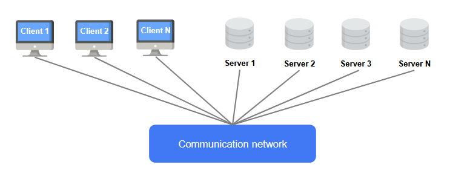
* มี 2 ชั้นคือ Client ↔ Server
* Client ส่ง SQL ไปให้ Server ประมวลผล → Server ส่งผลลัพธ์กลับมา
* ใช้กันบ่อยกับ แอปเล็ก ๆ หรือระบบที่ไม่ได้ซับซ้อน
* ข้อดี: ง่าย, เร็ว
* ข้อเสีย: ถ้า User เยอะ ๆ Server จะรับภาระหนัก

👉 ตัวอย่าง: โปรแกรมพนักงานธนาคารที่ต่อ DB โดยตรง

### 🔹 4) Three-tier Client/Server Architecture
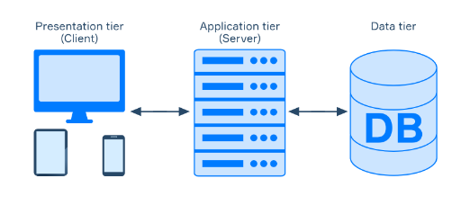
* เพิ่มชั้น Application Server (Middle tier) ระหว่าง Client ↔ Database Server
* Client (UI): ผู้ใช้ติดต่อกับระบบ เช่น เว็บเบราว์เซอร์
* Application Server: เก็บ Business Logic (กฎการทำงาน) เช่น การตรวจสอบสิทธิ์, การคำนวณ, การ Validate ข้อมูล
* Database Server: เก็บข้อมูลจริง จัดการ Query
* ข้อดี:
    * ลดภาระตรง Database
    * ปลอดภัยขึ้น (Client ไม่คุยกับ DB โดยตรง)
    * ยืดหยุ่น ปรับขยายระบบได้ง่าย

👉 ตัวอย่าง: ระบบ E-commerce → ผู้ใช้ (Client) เข้าผ่านเว็บ → App Server จัดการกฎ (ตะกร้าสินค้า, ชำระเงิน) → DB Server เก็บข้อมูลสินค้าและออเดอร์

### 📌 สรุปภาพรวม
* Centralized = ทุกอย่างอยู่ที่ Server เดียว
* Client/Server = แบ่งงานระหว่าง Client ↔ Server
* Two-tier = Client ติดต่อกับ DB Server โดยตรง
* Three-tier = มี Application Server คั่นกลาง → ปลอดภัยและขยายได้ดีกว่า

---

## Classification of Database Management Systems By Data Model (Relational, Object, Hierarchical, Network)

### 🔹 1) By Data Model (ตามแบบจำลองข้อมูล)
* **Relational Model**
    * ใช้ตาราง (แถว-คอลัมน์) → ได้รับความนิยมที่สุด
    * เช่น MySQL, PostgreSQL, Oracle

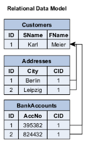

* **Object Data Model**
    * ข้อมูลเก็บเป็น “วัตถุ (Object)” คล้าย OOP
    * เช่น ObjectDB, db4o

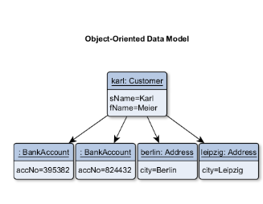

* **Hierarchical Model**
    * เก็บข้อมูลเป็นโครงสร้างต้นไม้ (Tree)
    * เหมาะกับข้อมูลแบบลำดับชั้น เช่น ระบบไฟล์
    * เช่น IBM IMS

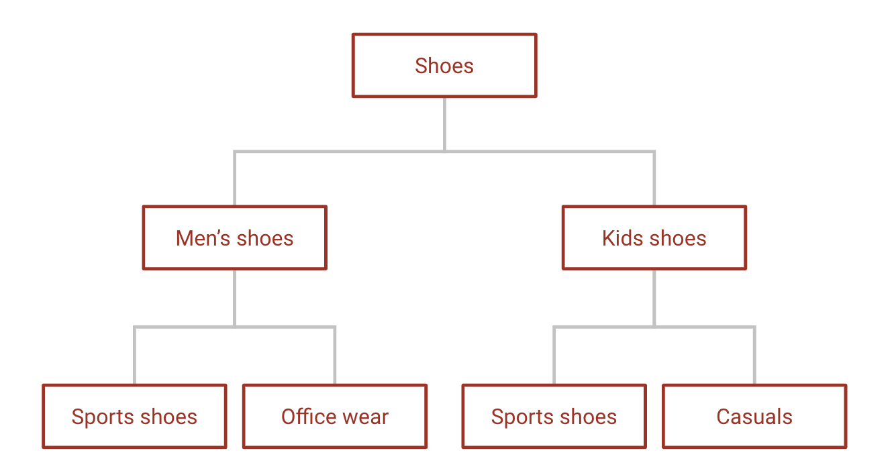

* **Network Model**
    * ข้อมูลเป็นโครงข่าย มีหลายเส้นทางเชื่อมโยง
    * เช่น IDMS (Integrated Data Management System)

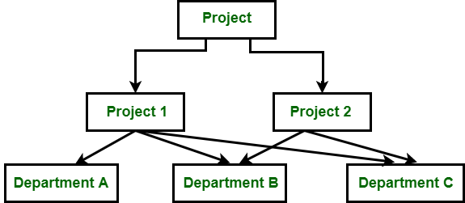

### 🔹 2) By Number of Users (ตามจำนวนผู้ใช้)
* **Single-user System**
    * ใช้งานโดยผู้ใช้คนเดียวในเวลาเดียวกัน
    * ตัวอย่าง: แอปเล็ก ๆ เก็บข้อมูลส่วนบุคคล (MS Access)
* **Multi-user System**
    * มีผู้ใช้หลายคนใช้งานพร้อมกัน
    * เช่น ระบบธนาคาร, ระบบ E-commerce

### 🔹 3) By Number of Sites (ตามจำนวนไซต์จัดเก็บ)
* **Centralized DBMS**
    * ข้อมูลเก็บที่เครื่องเดียว (ศูนย์กลาง)
    * ควบคุมง่าย แต่ถ้าเครื่องล่ม → ระบบทั้งหมดล่ม
* **Distributed DBMS (DDBMS)**
    * ข้อมูลกระจายอยู่หลายที่ (หลายเครื่อง/หลายเมือง)
    * ทำงานร่วมกันเสมือนเป็นฐานข้อมูลเดียว
    * เช่น Google Spanner, Cassandra


### 🔹 4) By Purpose (ตามวัตถุประสงค์)
* **General-purpose DBMS**
    * ใช้งานได้หลากหลาย (ยืดหยุ่น)
    * เช่น MySQL, PostgreSQL, Oracle
* **Special-purpose DBMS**
    * ออกแบบมาเฉพาะด้าน
    * เช่น DBMS สำหรับงาน Big Data, Time-series (InfluxDB), Graph DB (Neo4j)

### 📌 สรุปสั้น ๆ ในตาราง
|Criteria|ประเภท|ตัวอย่าง|
|---|---|---|
|Data Model|Relational, Object, Hierarchical, Network|MySQL, ObjectDB, IBM IMS, IDMS|
|Users|Single-user, Multi-user|MS Access, Oracle|
|Sites|Centralized, Distributed|Centralized DB, Google Spanner|
|Purpose|General-purpose, Special-purpose|MySQL, InfluxDB, Neo4j|