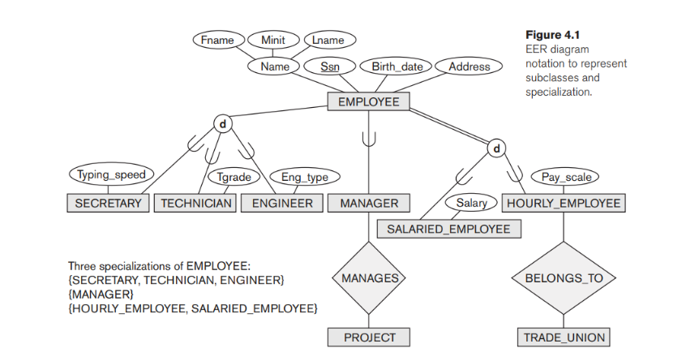
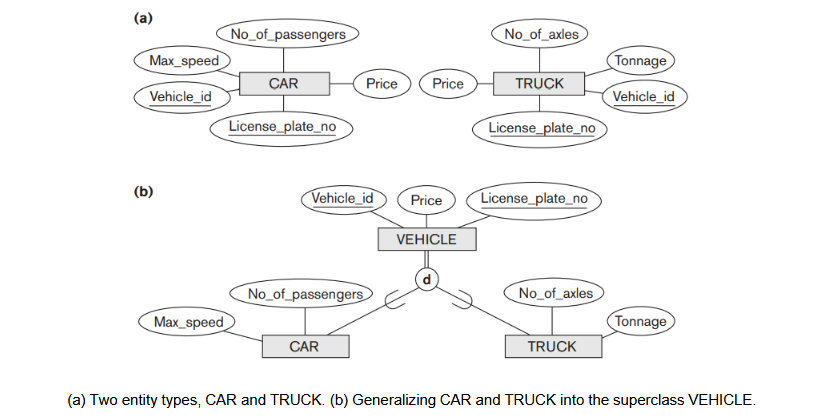
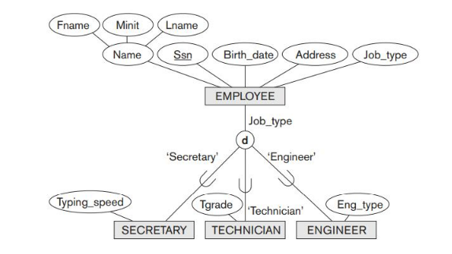
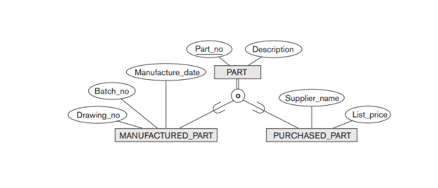
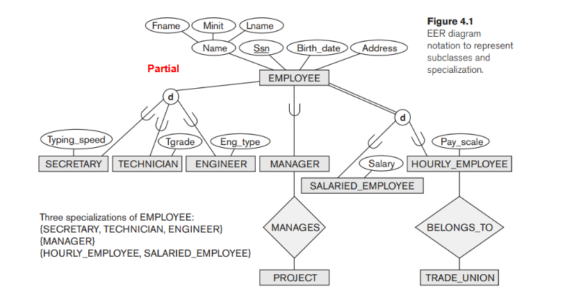
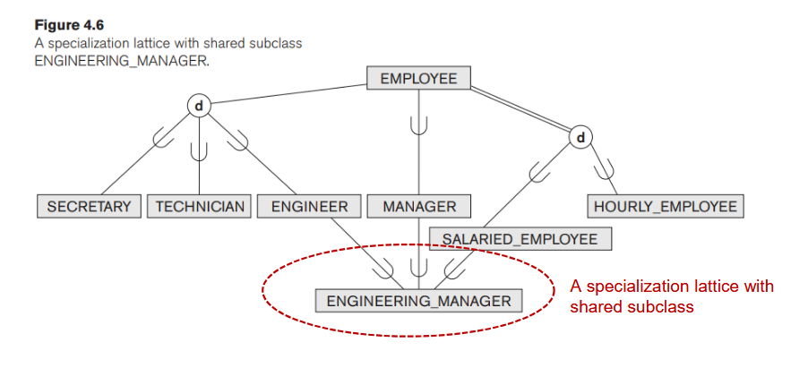
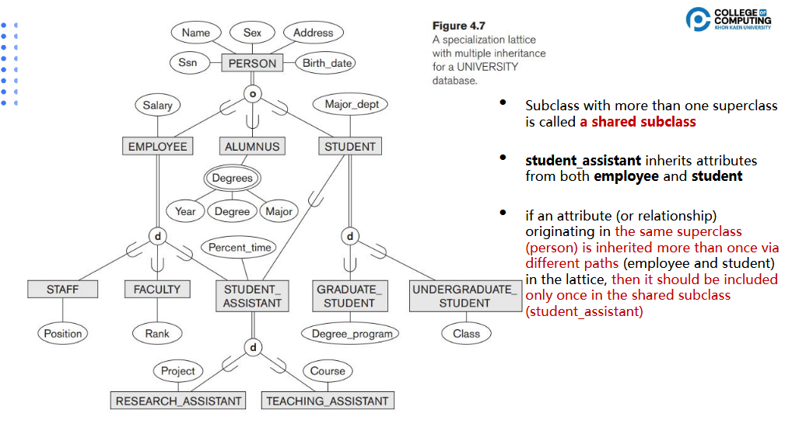
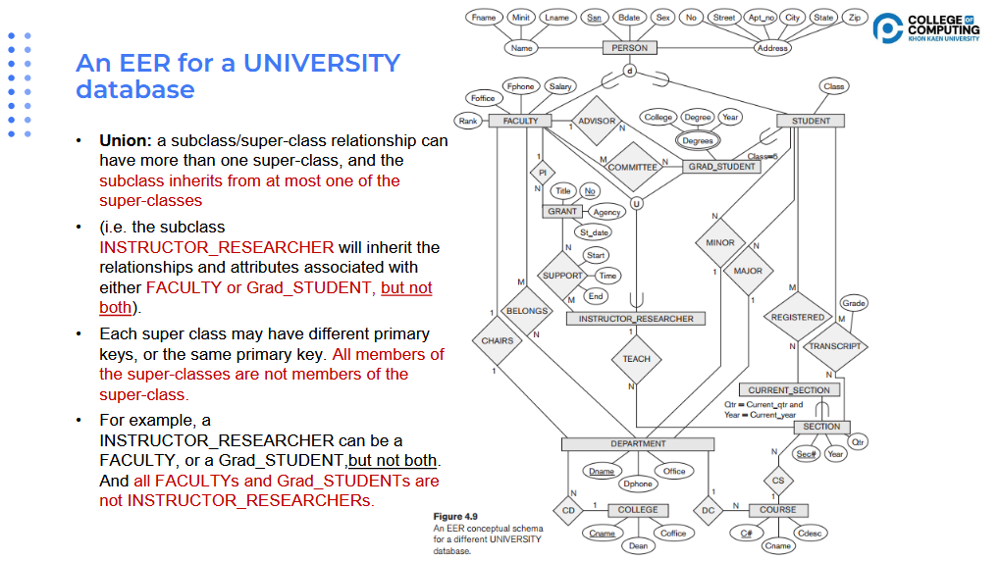
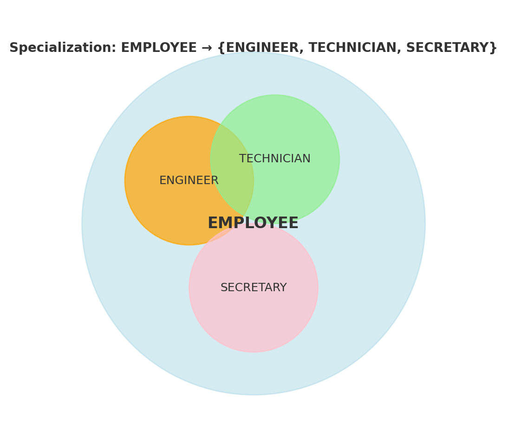

# Enhanced Entity-Relationship Model

## 📌 EER Concept
### 1. หลักการของ ER Model
ER Model (Entity-Relationship Model) เป็นโมเดลเชิงแนวคิด (Conceptual Model) สำหรับออกแบบฐานข้อมูล
* **Entity (เอนทิตี)** = วัตถุ/สิ่งของที่ต้องเก็บข้อมูล เช่น Student, Course, Employee
* **Attribute (คุณลักษณะ)** = คุณสมบัติของ Entity เช่น StudentID, Name, Birthdate
* **Relationship (ความสัมพันธ์)** = ความเกี่ยวข้องระหว่าง Entity เช่น Student registers Course

👉 จุดเด่นคือช่วยให้เห็นภาพรวมโครงสร้างข้อมูลก่อนจะนำไปแปลงเป็นฐานข้อมูลจริง

### 2. Subclass และ Superclass
* **Superclass** = เอนทิตีหลัก (แม่) ที่มีข้อมูลทั่วไป
* **Subclass** = เอนทิตีย่อย (ลูก) ที่สืบทอดข้อมูลจากแม่ แต่มีคุณสมบัติเพิ่มเติมเฉพาะตัว

🔹 ตัวอย่าง
* Superclass: Employee (มี EmpID, Name, Address)
* Subclass:
    * Technician (เพิ่ม Skill)
    * Engineer (เพิ่ม LicenseNo)

👉 Subclass จะ สืบทอด (inherit) attributes และ relationships จาก Superclass เสมอ

### 3. Specialization และ Generalization
* **Specialization (จำแนกเฉพาะ)**
    * แนวคิด Top-Down
    * เริ่มจาก Entity ใหญ่ → แยกออกเป็น Subclass ตามเงื่อนไขเฉพาะ
    * เช่น Employee → {Technician, Engineer, Secretary}
* **Generalization (รวมเป็นกลุ่ม)Generalization (รวมเป็นกลุ่ม)**
    * แนวคิด Bottom-Up
    * รวมหลาย Entity ที่มีลักษณะร่วมกันให้กลายเป็น Superclass
    * เช่น Car + Truck → Vehicle

👉 Specialization = แบ่งย่อย, Generalization = รวมกลุ่ม

### 4. Category (Union Type)
* เป็น Subclass ที่ได้จากการรวม Entity หลายตัวเข้าด้วยกัน
* ใช้เมื่อต้องการให้ Subclass รับสมาชิกจากหลาย Superclass ที่ต่างชนิดกัน

🔹 ตัวอย่าง
* **REGISTERED_VEHICLE** = Subclass ที่รวมบางส่วนของ Car และ Truck (แต่ไม่จำเป็นต้องรวมทั้งหมด)
* **OWNER** = อาจเป็น Person หรือ Bank หรือ Company

👉 Category ช่วยให้เราจัดการกับ “ความหลากหลาย” ของข้อมูลได้ง่ายขึ้น

### 5. Attribute และ Relationship Inheritance
* Inheritance = การสืบทอด Attribute และ Relationship จาก Superclass → Subclass
* Attribute ที่อยู่ใน Superclass จะถูกส่งต่อไปยัง Subclass โดยอัตโนมัติ
* Relationship ก็สืบทอดไปด้วย

🔹 ตัวอย่าง
* ถ้า Employee มีความสัมพันธ์ WorksFor → Department
* Subclass เช่น Engineer ก็จะ inherit ความสัมพันธ์นี้ด้วยเช่นกัน

### ✅ สรุปง่าย ๆ
* **ER Model** = Entity + Attribute + Relationship
* **Subclass/Superclass** = ความสัมพันธ์แบบแม่–ลูก
* **Specialization** = แบ่ง Entity ออกย่อย ๆ
* **Generalization** = รวม Entity หลาย ๆ ตัว
* **Category** = Union Subclass จากหลาย Superclass
* **Inheritance** = Subclass ได้ทั้ง Attributes และ Relationships ของ Superclass

---

## Subclass และ Superclass
### 1. Superclass (คลาสแม่)
* คือ Entity Type หลัก ที่เก็บ Attribute ทั่วไป ที่ใช้ร่วมกันได้กับทุก Subclass
* เป็นตัวแทน "สิ่งกว้าง ๆ"
* ตัวอย่าง:
    * Employee → เก็บข้อมูลพื้นฐานเช่น EmpID, Name, Address
    * Vehicle → เก็บข้อมูลทั่วไปเช่น PlateNo, Brand

### 2. Subclass (คลาสลูก)
* คือ Entity Type เฉพาะ ที่สืบทอด (inherit) ข้อมูลจาก Superclass
* มี Attribute หรือ Relationship พิเศษ เพิ่มขึ้นมา
* ตัวอย่าง:
    * Subclass ของ Employee
        * Engineer (เพิ่ม LicenseNo)
        * Technician (เพิ่ม Skill)
    * Subclass ของ Vehicle
        * Car (เพิ่ม NumOfDoors)
        * Truck (เพิ่ม LoadCapacity)
    
### 3. Inheritance (การสืบทอด)
* Subclass สืบทอด Attribute + Relationship ทั้งหมดจาก Superclass
* ทำให้ไม่ต้องเก็บข้อมูลซ้ำ
* สามารถเพิ่ม Attribute เฉพาะ ของตัวเองได้
* ตัวอย่าง
    * Superclass: Employee(EmpID, Name, Address)
    * Subclass:
        * Engineer(EmpID, Name, Address, LicenseNo)
        * Technician(EmpID, Name, Address, Skill)

### 4. Subclass/Superclass Relationship
* ความสัมพันธ์ระหว่าง Subclass–Superclass
* เรียกว่า “Is-A Relationship” | ของอาจารใช้คำนี้ "subclass/superclass relationship"
* หมายความว่า ทุก Subclass เป็นชนิดย่อยของ Superclass
* ตัวอย่าง:
    * Engineer “is a” Employee
    * Car “is a” Vehicle
* 📌 คุณสมบัติสำคัญ:
    * Entity หนึ่งใน Subclass ต้องเป็นสมาชิกของ Superclass เสมอ
    * แต่ไม่ใช่ว่า Entity ทุกตัวใน Superclass ต้องอยู่ใน Subclass (ขึ้นอยู่กับ Specialization แบบ Total/Partial)

### ✅ สรุปง่าย ๆ
* **Superclass** = เก็บคุณสมบัติทั่วไป
* **Subclass** = เก็บคุณสมบัติเฉพาะ (inherit มาจาก Superclass + เพิ่มของตัวเอง)
* **Inheritance** = Subclass ได้ Attribute + Relationship จาก Superclass
* **Subclass/Superclass Relationship** = “is-a” relationship เช่น Engineer is an Employee

---

## 📌 Specialization
### 1. ความหมายของ Specialization
* Specialization คือกระบวนการ “จำแนก” (Top-Down) จาก Superclass → Subclass
* List หัวข้อเนื้อหา EER Model
* แต่ละ Subclass จะ สืบทอด (inherit) Attribute และ Relationship จาก Superclass

👉 พูดง่าย ๆ: “เอาของใหญ่ มาแยกย่อยตามความแตกต่าง”

### 2. ตัวอย่าง: Employee → Secretary, Technician, Engineer
* Superclass: Employee (EmpID, Name, Address)
* Subclass:
    * Secretary (เพิ่ม TypingSpeed)
    * Technician (เพิ่ม Skill)
    * Engineer (เพิ่ม LicenseNo)

🔹 ERD (แนวคิด):
```
Employee
   ├── Secretary
   ├── Technician
   └── Engineer
```



### 3. กระบวนการ Specialization
1. ระบุ Subclass ที่ต้องการ → เช่น แบ่งตามงาน หรือคุณสมบัติ
2. สร้าง Entity สำหรับ Subclass → เพิ่ม Attribute/Relationship เฉพาะ
3. เชื่อมโยงกับ Superclass → ใช้เส้นแสดง Is-A Relationship

👉 ใน ERD: ใช้ สามเหลี่ยมคว่ำ เชื่อม Superclass → Subclass

### 4. ความแตกต่างกับ Entity–Entity Relationship
* Entity–Entity Relationship
    * คือ ความสัมพันธ์ ระหว่าง Entity 2 ตัวที่ไม่เหมือนกัน
    * เช่น Student registers Course
* Superclass–Subclass Relationship (Specialization)
    * คือ Is-A Relationship ภายในชนิดเดียวกัน
    * Subclass เป็นส่วนหนึ่ง ของ Superclass
    * เช่น Engineer is an Employee

👉 พูดง่าย ๆ:
* Entity–Entity = “เกี่ยวข้องกัน”
* Specialization = “เป็นชนิดย่อยของ”

### 5. เหตุผลในการใช้ Superclass/Subclass
* ลดการซ้ำซ้อนของข้อมูล (Data Redundancy)
* ช่วยให้แบบจำลองฐานข้อมูล ยืดหยุ่นและชัดเจน
* ใช้รองรับ Attribute/Relationship เฉพาะบางกลุ่ม
    * เช่น ไม่ใช่ Employee ทุกคนมี LicenseNo → จึงแยก Engineer ออกมา
* ทำให้ แบบจำลอง (Schema) อ่านง่ายขึ้น

### ✅ สรุปง่าย ๆ
* Specialization = Top-Down → แบ่ง Superclass ออกเป็น Subclass
* ใช้เพื่อจัดเก็บข้อมูล เฉพาะบางกลุ่ม โดยไม่ทำให้ Superclass มีข้อมูลที่ไม่จำเป็น
* ความสัมพันธ์ที่เกิดขึ้นเรียกว่า Is-A Relationship
* ต่างจาก Entity–Entity ที่เป็น ความสัมพันธ์ข้าม Entity

### เพิ่มเติม
ตัว d ใน EER Diagram ย่อมาจาก Disjointness Constraint
* ใช้กำหนดว่า Subclass ที่อยู่ใต้ Superclass นั้น ไม่สามารถซ้ำกันได้
* หมายความว่า หนึ่ง EMPLOYEE จะอยู่ได้เพียง Subclass เดียว เท่านั้น
* เช่น:
    * ถ้าเป็น Engineer จะไม่สามารถเป็น Technician หรือ Secretary พร้อมกันได้
    * ถ้าเป็น Hourly_employee ก็จะไม่สามารถเป็น Salaried_employee ได้
    * 👉 ถ้าเป็นแบบ Overlapping จะใช้สัญลักษณ์ o (แทนว่า 1 entity อาจอยู่ได้หลาย Subclass พร้อมกัน)

---

## Generalization

### 1. ความหมายของ Generalization
* Generalization คือกระบวนการ “รวม” (Bottom-Up)
* เริ่มจาก หลาย Entity ย่อย ที่มีคุณสมบัติร่วมกัน → รวมขึ้นมาเป็น Superclass
* เป็นกระบวนการตรงข้ามกับ Specialization

👉 พูดง่าย ๆ: “เอาของย่อย มารวมเป็นกลุ่มใหญ่”

### 2. ตัวอย่าง: Car + Truck → Vehicle

* Entity:
    * Car (มี NumOfDoors)
    * List หัวข้อเนื้อหา EER Model
* ทั้งคู่มีข้อมูลร่วมกัน เช่น PlateNo, Brand
* Generalization รวมขึ้นเป็น Vehicle
    * Vehicle(PlateNo, Brand)
    * Car inherits from Vehicle
    * Truck inherits from Vehicle

### 3. Disjointness Constraint (Disjoint / Overlapping)
เป็น ข้อจำกัดว่า Subclass สามารถทับซ้อนกันได้ไหม
* Disjoint (d)
    * แต่ละ Entity อยู่ได้แค่ 1 Subclass เท่านั้น
    * เช่น Vehicle → {Car, Truck}
        * Car ≠ Truck → คันหนึ่งเป็น Car ก็จะไม่ใช่ Truck



* Overlapping (o)
    * Entity สามารถอยู่ในหลาย Subclass ได้
    * เช่น Person → {Employee, Student}
        * คน ๆ เดียวกันอาจเป็นได้ทั้ง Employee และ Student
    


### 4. Completeness Constraint (Total / Partial Specialization)
บอกว่า ทุก Entity ใน Superclass ต้องอยู่ใน Subclass ไหม
* Total Specialization
    * ทุก Entity ของ Superclass ต้องอยู่ใน Subclass อย่างน้อย 1
    * แทนด้วย เส้นคู่
    * เช่น Employee = {Hourly, Salaried} → ต้องเลือกแบบใดแบบหนึ่งเสมอ
* Partial Specialization
    * อนุญาตให้ Entity บางตัวไม่อยู่ใน Subclass ก็ได้
    * แทนด้วย เส้นเดี่ยว
    * เช่น Employee → {Engineer, Technician}
        * บาง Employee อาจไม่ใช่ทั้ง Engineer และ Technician



### 5. Specialization Hierarchy
* คือโครงสร้างลำดับชั้น (Tree) ของการทำ Specialization
* คุณสมบัติ:
    * Subclass แต่ละตัวมี Parent ได้เพียง 1 ตัว
    * เช่น Vehicle → Car → ElectricCar

### 6. Specialization Lattices (Shared Subclass)
* คือโครงสร้างที่ Subclass มีได้มากกว่า 1 Parent
* เรียกว่า Shared Subclass
* ตัวอย่าง:
    * **STUDENT_ASSISTANT** inherits มาจากทั้ง **STUDENT** และ **EMPLOYEE**
    * ได้ทั้ง Attribute ของ Student และ Employee
* ต้องระวัง การสืบทอดซ้ำซ้อน (multiple inheritance)
    * เช่น Attribute เดียวกันมาจากหลายเส้นทาง ต้องเก็บแค่ครั้งเดียว





---

## 📌 Specialization & Generalization in Schema Refinement
### 1. Specialization = Top-Down Conceptual Refinement
* เป็นการออกแบบ จากบนลงล่าง (Top-Down)
* เริ่มจาก Entity ใหญ่ (Superclass) → แตกออกเป็น Subclass ตามคุณสมบัติเฉพาะ
* เหมือนการ "ซอยข้อมูลให้เล็กลง" เพื่อเก็บรายละเอียดที่แตกต่างกัน
* ตัวอย่าง:
    * เริ่มจาก Entity ใหญ่ = Employee
    * แตกออกเป็น Subclass:
        * Secretary (เพิ่ม Typing_speed)
        * Technician (เพิ่ม Tgrade)
        * Engineer (เพิ่ม Eng_type)
    * ผลลัพธ์: Schema มีความ เฉพาะเจาะจงขึ้น

👉 คิดแบบกว้างก่อน → แยกย่อยทีหลัง

### 2. Generalization = Bottom-Up Conceptual Refinement
* เป็นการออกแบบ จากล่างขึ้นบน (Bottom-Up)
* เริ่มจาก หลาย Entity ย่อย → รวมเข้าด้วยกันเป็น Superclass ถ้ามีคุณสมบัติร่วมกัน
* เหมือนการ "จัดกลุ่มข้อมูลที่คล้ายกัน" เพื่อไม่ให้ซ้ำซ้อน
* ตัวอย่าง:
    * มี Entity ย่อย:
        * Car(PlateNo, Brand, NumOfDoors)
        * Truck(PlateNo, Brand, LoadCapacity)
    * รวมขึ้นเป็น Superclass: Vehicle(PlateNo, Brand)
    * Car, Truck inherit จาก Vehicle
    * ผลลัพธ์: Schema มีความ กะทัดรัดและเป็นมาตรฐาน

👉 คิดจากรายละเอียดเล็ก ๆ → รวมเป็นภาพใหญ่

### ✅ สรุป
* Specialization: Top-Down → เน้น แตก Entity ใหญ่ ให้เล็กลงเพื่อบันทึกความแตกต่าง
* Generalization: Bottom-Up → เน้น รวม Entity เล็ก เข้าด้วยกันเพื่อกำจัดความซ้ำซ้อน
* ทั้งสองแนวคิดช่วย ปรับแต่ง Schema ให้เหมาะสมกับปัญหาจริง
    * Specialization = เพิ่มความเฉพาะเจาะจง
    * Generalization = เพิ่มความกะทัดรัด

---

## 📌 Modeling of UNION Types Using Categories
### 1. Category subclass คืออะไร
* Category (หรือ Union Type) = Subclass ที่สร้างขึ้นจาก การรวม (Union) ของหลาย ๆ Superclass
* สมาชิกของ Category subclass จะต้องมาจาก อย่างน้อยหนึ่ง Superclass ที่กำหนดไว้
* ใช้ในกรณีที่ Subclass ไม่ได้สืบทอดจาก Superclass เดียว แต่เลือกได้จากหลาย Superclass

👉 หมายความว่า Category subclass ไม่ได้ “ครอบคลุมทั้งหมด” เหมือน Generalization แต่ “เลือกบางส่วน” จากหลาย Entity


### 2. ตัวอย่าง: REGISTERED_VEHICLE (Car ∪ Truck)
* Superclass: Car, Truck
* Category subclass: Registered_Vehicle
    * รวมบาง Car และบาง Truck ที่ถูกจดทะเบียน
    * ไม่จำเป็นต้องรวม Car/Truck ทุกคัน
* ความหมาย:
    * Registered_Vehicle ⊆ Car ∪ Truck
    * รถที่อยู่ใน Registered_Vehicle ต้องเป็น Car หรือ Truck เท่านั้น แต่ไม่ใช่ว่าทุก Car/Truck จะต้องอยู่ใน Registered_Vehicle

### 3. ตัวอย่าง: OWNER (Person ∪ Bank ∪ Company)
* Superclass: Person, Bank, Company
* Category subclass: Owner
    * ใช้เมื่อ Owner อาจเป็นได้หลายประเภท
    * เช่น รถยนต์คันหนึ่งอาจมี Owner เป็นบุคคล, ธนาคาร, หรือบริษัท
* ความหมาย:
    * Owner ⊆ Person ∪ Bank ∪ Company

### 4. Union subtype/supertype ใน University Database

* ตัวอย่าง: INSTRUCTOR_RESEARCHER
    * เป็น Category subclass ที่สืบทอดจาก:
        * FACULTY หรือ GRAD_STUDENT
    * แต่ไม่สามารถเป็นทั้งสองได้พร้อมกัน (เลือกได้ 1 Superclass เท่านั้น)
* ความหมาย:
    * INSTRUCTOR_RESEARCHER ⊆ FACULTY ∪ GRAD_STUDENT
    * ไม่ใช่ FACULTY ทุกคน หรือ GRAD_STUDENT ทุกคนจะเป็น INSTRUCTOR_RESEARCHER

### ✅ สรุปสั้น ๆ
* Category subclass = Subclass ที่เกิดจากการ รวมบางส่วน ของหลาย Superclass
* Registered_Vehicle = รวม Car + Truck บางส่วน
* Owner = รวม Person, Bank, Company
* University DB = INSTRUCTOR_RESEARCHER รวม Faculty กับ Grad_Student

👉 จุดเด่นของ Category = ความยืดหยุ่น (เลือกบางส่วนจากหลายประเภท แต่ไม่จำเป็นต้องรวมทั้งหมด)

### เพิ่มเติม 📌 ตัวอย่างข้อมูล Category subclass
#### 1. REGISTERED_VEHICLE (Car ∪ Truck)
##### Superclass: Car
| PlateNo | Brand  | NumOfDoors |
| ------- | ------ | ---------- |
| C101    | Toyota | 4          |
| C102    | Honda  | 2          |
##### Superclass: Truck
| PlateNo | Brand | LoadCap (kg) |
| ------- | ----- | ------------ |
| T201    | Isuzu | 2000         |
| T202    | Hino  | 5000         |
##### Category subclass: Registered_Vehicle
| PlateNo | Brand  | VehicleType |
| ------- | ------ | ----------- |
| C101    | Toyota | Car         |
| T201    | Isuzu  | Truck       |

👉 เห็นได้ว่า ไม่ใช่ทุก Car/Truck อยู่ใน Registered_Vehicle
แต่เลือกมาเฉพาะที่ “จดทะเบียนแล้ว”

#### 2. OWNER (Person ∪ Bank ∪ Company)
##### Superclass: Person
| PID  | Name  |
| ---- | ----- |
| P001 | Alice |
| P002 | Bob   |
##### Superclass: Bank
| BID  | BankName |
| ---- | -------- |
| B101 | KKU Bank |
##### Superclass: Company
| CID  | CompName |
| ---- | -------- |
| C201 | Toyota   |
##### Category subclass: Owner
| OwnerID | OwnerType | Name/Entity |
| ------- | --------- | ----------- |
| P001    | Person    | Alice       |
| B101    | Bank      | KKU Bank    |
| C201    | Company   | Toyota      |
👉 Owner เกิดจากการรวมบางส่วนของ Person, Bank, Company
ไม่ใช่ว่า ทุกคน/ทุกธนาคาร/ทุกบริษัทต้องเป็น Owner

#### ✅ สรุป
* Category subclass = คล้าย View ที่ select มาจากหลายตาราง (Superclass)
* แต่ใน EER มันหมายถึง "แนวคิด" ว่า Subclass นี้ดึงสมาชิกบางส่วนจาก Union ของหลาย Superclass
* ใช้เพื่อรองรับกรณีที่ Entity เดียวกันอาจมาจากหลายต้นกำเนิด

---

## 📌 Formal Definition of EER Concepts
### 1. Class = Set of Entities
* ในมุมมองเชิงทฤษฎี Entity Type (Class) = เซตของ Entity Instances
* เช่น:
    * `EMPLOYEE = {e1, e2, e3, …}`
    * `CAR = {c1, c2, c3, …}`
* ทุก Entity (record) ที่อยู่ใน Class นั้น ๆ จะมีคุณสมบัติ (attributes) ตามที่กำหนด
### 2. Subclass S ⊆ Superclass C
* Subclass = เซตย่อย (Subset) ของ Superclass
* หมายถึง Entity ทุกตัวใน Subclass ต้องเป็นสมาชิกของ Superclass เสมอ
* ตัวอย่าง:
    * `ENGINEER ⊆ EMPLOYEE`
    * ถ้า `e2 ∈ ENGINEER` → ต้อง `e2 ∈ EMPLOYEE` ด้วย
    * แต่ไม่ใช่ว่า Employee ทุกคนต้องเป็น Engineer
### 3. Specialization Z = `{S1, S2, …, Sn}`
* Specialization = การสร้าง Subclass หลายตัวจาก Superclass ตัวเดียว
* เขียนเป็นเซต:
    * *Z = {S1, S2, …, Sn}*
    * โดยที่ *Si ⊆ G* (ทุก Subclass เป็น subset ของ Superclass G)
* Superclass G เรียกว่า Generalized Entity Type
* ตัวอย่าง:
    * `EMPLOYEE` → Specialization → `{ENGINEER, TECHNICIAN, SECRETARY}`
* หมายถึง:
    * `ENGINEER ⊆ EMPLOYEE`
    * `TECHNICIAN ⊆ EMPLOYEE`
    * `SECRETARY ⊆ EMPLOYEE`

### ✅ สรุป
* Class = Set ของ Entities
* Subclass = Subset ของ Superclass
* Specialization = เซตของ Subclass ที่แบ่งออกจาก Superclass เดียวกัน

