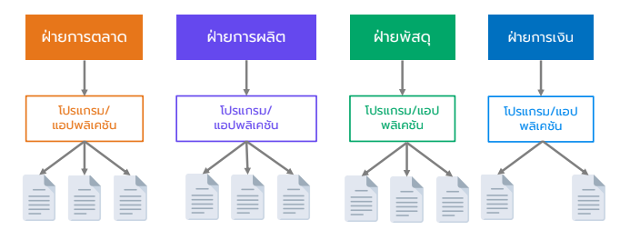
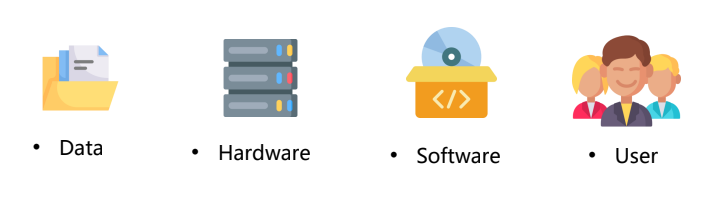
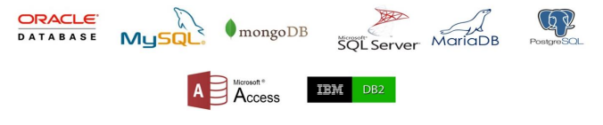
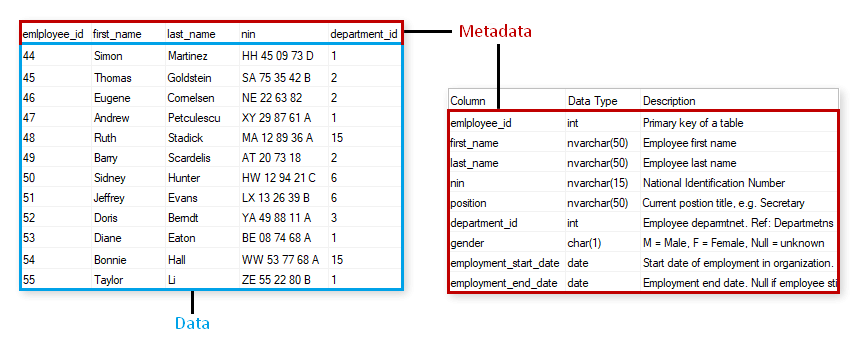

# Introduction to Database Systems

## Introduction
### 🔹What is a Database System?
* **Database (ฐานข้อมูล)** ก็คือการ “เก็บข้อมูลอย่างเป็นระบบ”
เช่น ถ้าคุณจดเบอร์เพื่อนลงสมุดนั่นคือฐานข้อมูลแบบง่าย ๆ
* **Database System** คือ ระบบที่ใช้คอมพิวเตอร์ช่วยจัดเก็บและจัดการข้อมูล
→ ทำให้ผู้ใช้สามารถ เก็บ-ค้นหา-แก้ไข ข้อมูลได้สะดวก

**👉 คำสำคัญ (Keyword):**
* **Database** = ฐานข้อมูล
* **DBMS (Database Management System)** = ซอฟต์แวร์ที่ใช้จัดการฐานข้อมูล

### 🔹Data vs Information
* **Data (ข้อมูลดิบ)**: ตัวเลข ตัวอักษร หรือข้อเท็จจริงที่ยังไม่มีความหมายชัดเจน
เช่น "นักเรียน A ได้คะแนน 90"
* **Information (สารสนเทศ)**: ข้อมูลที่ถูกประมวลผลหรือแปลความจนเข้าใจได้
เช่น "นักเรียน A ได้คะแนนสูงที่สุดในห้อง"

**👉 พูดง่าย ๆ คือ Data → (ประมวลผล) → Information**
* **Data** เหมือนวัตถุดิบ
* **Information** เหมือนอาหารที่ปรุงเสร็จแล้ว

### 🔹Example of Data and Information
* **ตัวอย่าง Data:**
    * “Many **ได้คะแนน 90** ในการสอบกลางภาควิชา Database Management System”
* **ตัวอย่าง Information:**
    * “Many **ได้คะแนนสูงที่สุด**ในชั้นเรียน”
    * “Tony **ได้คะแนนสูงกว่าค่าเฉลี่ย** 5 คะแนน”

### 📌 สรุปแบบสั้น ๆ
* **Database System** = ระบบคอมพิวเตอร์ที่ช่วยเก็บและจัดการข้อมูล
* **Data** = ข้อมูลดิบ (ยังไม่สื่อความหมาย)
* **Information** = ข้อมูลที่ผ่านการตีความแล้ว (สื่อความหมาย ใช้ตัดสินใจได้)

### คำถาม
ลองยกตัวอย่าง Data และ Information ของคุณเองสัก 1 ชุด

---

## Traditional File System

### 🔹Concept of Traditional File System

ก่อนที่จะมี **Database System** องค์กรต่าง ๆ จะเก็บข้อมูลแยกกันเป็น ไฟล์ของแต่ละฝ่าย
* ฝ่ายการตลาดมีไฟล์ของตัวเอง
* ฝ่ายการเงินก็มีไฟล์ของตัวเอง
* ฝ่ายพัสดุก็มีไฟล์ของตัวเอง

👉 ปัญหาคือไฟล์เหล่านี้ ไม่เชื่อมกัน แต่ละโปรแกรมก็อ่านไฟล์ของตัวเอง → ทำให้จัดการข้อมูลยุ่งยาก

### 🔹Disadvantages of Traditional File System
**1. Data Redundancy (ข้อมูลซ้ำซ้อน)**
* ข้อมูลเดียวกันถูกเก็บหลายที่
* เช่น “ที่อยู่ลูกค้า” อาจอยู่ทั้งฝ่ายการเงินและฝ่ายการตลาด → เสียพื้นที่ และอาจเก็บไม่ตรงกัน

**2. Data Inconsistency (ข้อมูลไม่สอดคล้อง)**
* เพราะเก็บซ้ำหลายที่ → เวลามีการแก้ไข บางไฟล์อาจไม่ได้อัปเดต
* เช่น เบอร์โทรลูกค้าเปลี่ยน แต่ฝ่ายการเงินแก้แล้ว ฝ่ายการตลาดยังใช้ข้อมูลเก่า

**3. Lack of Data Integration (ขาดการรวมศูนย์ข้อมูล)**
* ข้อมูลกระจายอยู่หลายไฟล์
* ถ้าอยากสรุปเป็น “รายงานรวม” ต้องไปเปิดทีละไฟล์ → เสียเวลา

**4. Program Dependence (โปรแกรมขึ้นกับโครงสร้างไฟล์)**
* ถ้าเปลี่ยนโครงสร้างไฟล์ (เช่น เพิ่มฟิลด์ใหม่) → โปรแกรมทั้งหมดที่ใช้ไฟล์นี้ต้องแก้ตาม
* ทำให้การปรับปรุงระบบยุ่งยาก

**5. Limited Data Sharing (ใช้ข้อมูลร่วมกันได้จำกัด)**
* เพราะแต่ละแผนกเก็บไฟล์ของตัวเอง → ไม่สามารถแชร์ข้อมูลให้กันง่าย ๆ
* บางครั้งต้อง copy ไฟล์ส่งต่อกัน → ยิ่งเพิ่มโอกาสข้อมูลไม่ตรง

**6. Problem of Security (ปัญหาความปลอดภัย)**
* ยากที่จะกำหนดสิทธิ์ว่าใครเข้าถึงไฟล์ไหนได้
* ไม่มีระบบตรวจสอบว่าใครแก้ไขไฟล์ไปบ้าง

### 📌 สรุปสั้น ๆ
**Traditional File System** = “แต่ละฝ่ายเก็บไฟล์ของตัวเอง”
→ ผลลัพธ์คือ ข้อมูลซ้ำ, ข้อมูลไม่ตรงกัน, แชร์ยาก, ปลอดภัยน้อย

### คำถาม
**สถานการณ์:**
1. ฝ่ายการเงินอัปเดตเบอร์โทรลูกค้าใหม่ แต่ฝ่ายการตลาดยังใช้เบอร์เก่าอยู่
2. ในบริษัทเดียวกัน มีไฟล์ “ที่อยู่ลูกค้า” อยู่ทั้งในฝ่ายการเงิน ฝ่ายพัสดุ และฝ่ายการตลาด → ข้อมูลเดียวกันถูกเก็บ 3 ไฟล์

👉 คุณคิดว่าเข้ากับปัญหาไหนครับ?

--- 

## What is a Database?
### 🔹ความหมายของ Database จากหลายแหล่ง
1. **Wiki**
    * Database = การเก็บข้อมูลอย่างเป็นระบบ (organized collection of data)
    * ใช้ซอฟต์แวร์ `DBMS (Database Management System)` เพื่อให้ผู้ใช้และแอปพลิเคชันเข้าถึงและจัดการข้อมูลได้

2. **C.J. Date (นักวิชาการด้านฐานข้อมูลชื่อดัง)**
    * Database = ชุดข้อมูลที่จัดเก็บถาวร (persistent data) ที่ถูกใช้โดยระบบขององค์กร

3. **Elmasri & Navathe (ผู้เขียนหนังสือ Database Systems)**
    * Database = ชุดของข้อมูลที่มีความสัมพันธ์กัน (related data)
    * ข้อมูล (Data) หมายถึงข้อเท็จจริง (facts) ที่บันทึกได้และมีความหมายโดยนัย

👉 จากทุกความหมาย จะเห็นตรงกันว่า Database ไม่ใช่แค่การเก็บข้อมูล แต่ต้องเป็นข้อมูลที่มีโครงสร้าง เป็นระบบ และใช้ร่วมกันได้

### 🔹Database System
* คือระบบคอมพิวเตอร์ที่ใช้จัดเก็บและบริหารข้อมูล (Database + DBMS + ผู้ใช้)
* จุดประสงค์หลักคือ:
    * จัดเก็บข้อมูลและสารสนเทศ อย่างเป็นระบบ
    * ให้ผู้ใช้ ค้นหา (Retrieve), เพิ่ม/แก้ไข (Update), และจัดการ (Manage) ข้อมูลได้สะดวก

👉 พูดง่าย ๆ คือ Database System = “ศูนย์กลางข้อมูล ที่ทุกคนในองค์กรเข้ามาใช้ร่วมกันได้ โดยมี DBMS คอยควบคุม”

### 📌 สรุปสั้น ๆ
* **Database** = ชุดข้อมูลที่เป็นระบบ มีความสัมพันธ์ และเก็บถาวร
* **Database System** = ระบบคอมพิวเตอร์ที่ประกอบด้วย Database + DBMS + ผู้ใช้

--- 

## Database System Components

### 🔹 1. Data (ข้อมูล)
* เป็น `“หัวใจหลัก”` ของระบบฐานข้อมูล
* เก็บข้อเท็จจริง (facts) เช่น ชื่อ, เบอร์โทร, ที่อยู่, ยอดขาย
* ข้อมูลเหล่านี้จะถูกจัดเก็บอย่าง เป็นระบบ และสามารถ เรียกใช้ร่วมกัน ได้

👉 เปรียบเทียบง่าย ๆ: เหมือน “วัตถุดิบ” ที่ร้านอาหารต้องมี

### 🔹 2. Hardware (ฮาร์ดแวร์)
* อุปกรณ์คอมพิวเตอร์ที่ใช้เก็บและประมวลผลข้อมูล
    * CPU, RAM → สำหรับรัน DBMS
    * Storage (Hard disk, SSD) → สำหรับเก็บข้อมูลถาวร
* ยิ่งฮาร์ดแวร์ดีเท่าไร ระบบฐานข้อมูลก็ทำงานได้เร็วและมีประสิทธิภาพมากขึ้น

👉 เหมือน “ครัวและตู้เก็บวัตถุดิบ” ในร้านอาหาร

### 🔹 3. Software (DBMS – Database Management System)
* เป็นโปรแกรมที่ใช้ จัดการฐานข้อมูล เช่น MySQL, Oracle, PostgreSQL, SQL Server
* ทำหน้าที่:
    * เก็บ/ดึงข้อมูล
    * ป้องกันความผิดพลาด (crash recovery)
    * กำหนดสิทธิ์การเข้าถึง (security)
    * ให้หลายคนใช้งานพร้อมกันได้ (multi-user)

👉 เหมือน “เชฟใหญ่ + ระบบจัดการครัว” ที่ดูแลทุกอย่าง

### 🔹 4. Users (ผู้ใช้งาน)
ผู้ใช้ฐานข้อมูลมีหลายประเภทครับ แบ่งเป็นกลุ่ม ๆ ได้ดังนี้:
1. **End Users (ผู้ใช้ทั่วไป)**
    * ใช้โปรแกรมที่เชื่อมกับฐานข้อมูลโดยตรง เช่น แอปจองตั๋ว, แอปธนาคาร
    * ไม่ต้องรู้เรื่อง SQL หรือวิธีเก็บข้อมูล

2. **Application Programmer (นักพัฒนาโปรแกรม)**
    * เขียนโปรแกรม/แอปพลิเคชันที่ดึงข้อมูลจากฐานข้อมูลมาให้ End Users ใช้
    * เช่น เขียนแอปจองอาหาร เชื่อมกับฐานข้อมูลเมนูและสต็อก

3. **Database Designers (ผู้ออกแบบฐานข้อมูล)**
    * ออกแบบโครงสร้างข้อมูล (schema) เช่น ตารางอะไรบ้าง, ความสัมพันธ์ระหว่างตาราง
    * ต้องคุยกับผู้ใช้จริงก่อน เพื่อออกแบบให้ตรงกับความต้องการ

4. **Database Administrators (DBA)**
    * เป็น “ผู้ดูแลฐานข้อมูล”
    * หน้าที่:
        * อนุญาตสิทธิ์การเข้าถึง (security)
        * สำรอง/กู้คืนข้อมูล (backup & restore)
        * ปรับแต่งประสิทธิภาพ (performance tuning)
    * เปรียบได้กับ “หัวหน้าครัว + ผู้จัดการร้าน”

### 📌 สรุปภาพรวม
* **Data** = ข้อมูล (วัตถุดิบ)
* **Hardware** = อุปกรณ์ (ครัว/ตู้เก็บของ)
* **Software (DBMS)** = ระบบจัดการ (เชฟใหญ่/ระบบครัว)
* **Users** = คนที่เข้ามาใช้งาน (ลูกค้า, พนักงาน, ผู้จัดการ)

---

## Database Management System (DBMS)

### 🔹 ความหมายของ DBMS
* **DBMS (Database Management System)** คือ ซอฟต์แวร์ ที่ช่วยจัดการฐานข้อมูล
* ผู้ใช้ไม่ต้องกังวลว่า “ข้อมูลเก็บในฮาร์ดดิสก์ยังไง” เพราะ DBMS จะจัดการให้ทั้งหมด
* ตัวอย่าง **DBMS** ที่นิยม: *MySQL*, *Oracle*, *PostgreSQL*, *SQL* *Server*, *MongoDB*

👉 พูดง่าย ๆ: DBMS = “ผู้จัดการฐานข้อมูล” ที่คอยควบคุมทุกอย่างแทนเรา

### 🔹 Functions ของ DBMS

1. **Manipulating (การจัดการข้อมูล)**
    * ดึงข้อมูล (Retrieve) → เช่น “หาสินค้าที่ขายดีที่สุด”
    * เพิ่ม/แก้ไข/ลบข้อมูล (Update/Delete) → เช่น “เพิ่มสินค้าลงคลัง” หรือ “แก้ราคาสินค้า”
    * สร้างรายงาน (Report) → เช่น “ยอดขายรายเดือน”

2. **Sharing (การใช้งานร่วมกัน)**
    * อนุญาตให้หลายคนหรือหลายโปรแกรมเข้าถึงฐานข้อมูล พร้อมกัน ได้
    * เช่น ร้านค้าออนไลน์มีลูกค้าหลายพันคนสั่งซื้อพร้อม ๆ กัน แต่ระบบยังต้องทำงานได้ไม่ล่ม

3. **Crash Recovery (การกู้คืนเมื่อระบบล้ม)**
    * ถ้าระบบไฟดับ, เครื่องค้าง, ฮาร์ดดิสก์พัง → DBMS ต้องมีกลไกกู้คืนข้อมูล
    * เช่น ใช้ Backup และ Transaction Log เพื่อกู้ฐานข้อมูลกลับมา
    * เป้าหมายคือ “ไม่ให้ข้อมูลสูญหาย”
4. **Security (ความปลอดภัย)**
    * DBMS กำหนดสิทธิ์การเข้าถึงได้ (Access Control)
        * เช่น ลูกค้า → ดูสินค้าของตัวเองได้
        * แอดมิน → จัดการสินค้าทั้งหมดได้
    * ใช้ Username + Password
    * มีระบบตรวจสอบ (Audit) → ว่าใครแก้ไขข้อมูลอะไรไปบ้าง

### 📌 สรุปสั้น ๆ
**DBMS** = ผู้จัดการฐานข้อมูล ทำหน้าที่:
* **Manipulating** → จัดการข้อมูล
* **Sharing** → ให้หลายคนใช้พร้อมกัน
* **Crash Recovery** → กู้ข้อมูลเวลาเกิดปัญหา
* **Security** → ปกป้องข้อมูลจากการเข้าถึงที่ไม่ได้รับอนุญาต

---

## Metadata
### 🔹 Metadata คืออะไร?

* Metadata = ข้อมูลเกี่ยวกับข้อมูล (Data about Data)
* ไม่ได้เก็บ “ข้อมูลจริง” แต่เก็บ “รายละเอียดของข้อมูล”
* เช่น:
    * ตารางชื่อลูกค้า มีคอลัมน์อะไรบ้าง?
    * แต่ละคอลัมน์เป็นชนิดข้อมูลอะไร (string, number, date)?
    * ข้อมูลนี้เชื่อมกับตารางไหน?

👉 เปรียบเทียบง่าย ๆ: ถ้า ฐานข้อมูล = ห้องสมุด
* ข้อมูล (Data) = หนังสือในห้องสมุด
* Metadata = บัตรรายการ/ระบบค้นหนังสือ ที่บอกว่า “หนังสือเล่มนี้อยู่ชั้นไหน, เขียนโดยใคร, หมวดหมู่อะไร”

### 🔹 Data Dictionary / System Catalog

* คือ “ที่เก็บ Metadata” ของฐานข้อมูล
* DBMS จะสร้างและดูแล Data Dictionary ให้อัตโนมัติ
* ใช้บอกข้อมูลสำคัญ เช่น:
    * ชื่อตาราง, จำนวนคอลัมน์, ชนิดข้อมูล
    * ใครเป็นเจ้าของตาราง
    * ความสัมพันธ์ระหว่างตาราง
    * Constraints (ข้อจำกัด เช่น Primary Key, Foreign Key)

👉 เวลานักพัฒนาเขียน SQL → DBMS จะไปเช็คจาก Data Dictionary ก่อนว่าโครงสร้างตารางเป็นยังไง

### 📌 สรุปสั้น ๆ
* Metadata = “ข้อมูลเกี่ยวกับข้อมูล”
* Data Dictionary / System Catalog = ที่เก็บ Metadata
* ใช้เพื่อให้ DBMS รู้ว่า ฐานข้อมูลประกอบด้วยอะไรบ้าง และใช้งานอย่างไร

---

## Why Do We Need a Database System? Compactness

### 🔹 1) Compactness (กะทัดรัด)
* ไม่ต้องใช้เอกสารหรือกระดาษจำนวนมาก → ลดความยุ่งเหยิง
* เก็บทุกอย่างในคอมพิวเตอร์ได้หมด

👉 เหมือนเก็บหนังสือพันเล่มใน eBook แทนที่จะต้องมีห้องสมุดใหญ่ ๆ

### 🔹 2) Speed (รวดเร็ว)
* การค้นหาข้อมูลและแก้ไขทำได้ทันที
* เช่น ค้นหาชื่อนักเรียนในฐานข้อมูล ใช้เวลาเสี้ยววินาที
* ถ้าเป็นแฟ้มเอกสารแบบเดิม ต้องเปิดแฟ้มทีละเล่ม → ช้ามาก

### 🔹 3) Less Drudgery (ลดงานซ้ำซ้อน/น่าเบื่อ)
* การจัดการไฟล์ด้วยมือใช้เวลานาน เช่น คัดลอก แก้ไข
* Database ทำงานแทน เช่น สร้างรายงานยอดขายอัตโนมัติ → ไม่ต้องมานั่งรวมข้อมูลเอง

### 🔹 4) Currency (ข้อมูลเป็นปัจจุบันเสมอ)
* ฐานข้อมูลสามารถอัปเดตให้เป็น ข้อมูลล่าสุด ตลอดเวลา
* เช่น ระบบธนาคาร → ยอดเงินที่เห็นในแอปตรงกับที่เหลือจริง ณ ตอนนั้น

### 🔹 5) Protection (การปกป้องข้อมูล)
* Database มีระบบรักษาความปลอดภัยที่ดีกว่าไฟล์ธรรมดา
* เช่น กำหนดสิทธิ์การเข้าถึง → ผู้ใช้แต่ละคนดูได้ไม่เท่ากัน
* ป้องกันข้อมูลหาย/เสียหายด้วยระบบ Backup และ Recovery

### 📌 สรุปสั้น ๆ
เราใช้ Database System เพราะมัน:
1. กะทัดรัด (Compactness)
2. ค้นหาข้อมูลเร็ว (Speed)
3. ลดงานซ้ำซ้อน (Less Drudgery)
4. ข้อมูลเป็นปัจจุบัน (Currency)
5. ปลอดภัยกว่าระบบไฟล์ (Protection)

---

## Benefits of Database Approach Data Sharing

### 🔹 1) Data Sharing (ใช้ข้อมูลร่วมกันได้)
* ผู้ใช้หลายคน/หลายแอปพลิเคชันสามารถเข้าถึงข้อมูล พร้อมกัน ได้
* เช่น ระบบโรงพยาบาล → หมอ, พยาบาล, แผนกการเงิน สามารถเข้าถึงข้อมูลผู้ป่วยชุดเดียวกันได้

### 🔹 2) Redundancy Control (ควบคุมความซ้ำซ้อน)
* Database จัดเก็บข้อมูลเพียง ครั้งเดียว เพื่อลดการเก็บซ้ำหลายที่
* เช่น ที่อยู่ลูกค้าเก็บไว้ที่เดียว → ทุกแผนกเรียกใช้จากที่เดียว

### 🔹 3) Avoid Inconsistency (ลดปัญหาข้อมูลไม่สอดคล้อง)
* เมื่อข้อมูลเก็บที่เดียว → ถ้ามีการแก้ไข ก็แก้แค่ครั้งเดียว → ทุกคนเห็นข้อมูลตรงกัน
* เช่น เปลี่ยนเบอร์โทรลูกค้า → ทั้งฝ่ายการเงินและฝ่ายการตลาดเห็นข้อมูลใหม่เหมือนกัน

### 🔹 4) Security Support (สนับสนุนระบบความปลอดภัย)
* Database กำหนดสิทธิ์ได้ว่าใครดู/แก้ไขข้อมูลไหนได้บ้าง
* เช่น พนักงานทั่วไปอาจเห็นเฉพาะข้อมูลสินค้าคงคลัง แต่ผู้จัดการเห็นข้อมูลการเงินด้วย

### 🔹 5) Integrity Maintenance (รักษาความถูกต้องของข้อมูล)
* DBMS มี Constraints เช่น Primary Key, Foreign Key, NOT NULL
* ช่วยป้องกันไม่ให้ข้อมูลผิด เช่น
    * รหัสนักเรียนซ้ำ
    * คะแนนสอบเป็นค่าลบ

### 🔹 6) Security Enforcement (บังคับใช้นโยบายความปลอดภัย)
* นอกจากสนับสนุนแล้ว DBMS ยัง บังคับใช้จริง
* เช่น ต้องใช้ Username + Password ทุกครั้ง, บันทึกประวัติการใช้งาน (Audit log)

## 📌 สรุปสั้น ๆ
การใช้ Database ทำให้:
* แชร์ข้อมูลได้
* ลดข้อมูลซ้ำซ้อน
* ข้อมูลตรงกันเสมอ
* มีระบบรักษาความปลอดภัย
* รักษาความถูกต้องของข้อมูล
* และบังคับใช้นโยบายความปลอดภัยจริง ๆ

---

## Concepts in Database Management
### 🔹 1) Controlling Redundancy (การควบคุมข้อมูลซ้ำซ้อน)
* ปัญหา: ข้อมูลเดียวกันถูกเก็บหลายที่ → เปลืองพื้นที่ และเสี่ยงไม่ตรงกัน
* แนวคิด: เก็บข้อมูลที่เดียวใน Database แล้วให้ทุกระบบมาใช้ร่วมกัน
* ตัวอย่าง: ที่อยู่ลูกค้าเก็บในตาราง Customer ไม่ต้องเก็บซ้ำในตาราง Order หรือ Invoice

### 🔹 2) Inconsistency Example (ตัวอย่างข้อมูลไม่สอดคล้อง)
* ปัญหา: ข้อมูลซ้ำหลายไฟล์ พอแก้ไม่ครบ → ข้อมูลขัดแย้งกัน
* ตัวอย่างในสไลด์:
    * Mali Kritsana อายุ 37 → แต่บางไฟล์เขียน Mali Kitsana อายุ 37
    * Teerapong อายุ 25 ในไฟล์หนึ่ง แต่ 24 ในอีกไฟล์หนึ่ง
* บทเรียน: Database ต้องมีระบบควบคุมให้ข้อมูล consistent

### 🔹 3) Referential Integrity (ความถูกต้องของความสัมพันธ์)
* หมายถึง การเชื่อมโยงข้อมูลระหว่างตารางต้องถูกต้องเสมอ
* เช่น ถ้ามีตาราง Order (เก็บการสั่งซื้อ) → CustomerID ที่อยู่ใน Order ต้องมีจริงในตาราง Customer
* ป้องกัน “ข้อมูลแขวน” เช่น มี Order แต่ไม่มี Customer ที่อ้างอิง

### 🔹 4) Entity Integrity (ความถูกต้องของเอนทิตี)
* หมายถึง แต่ละเรคอร์ดในตารางต้อง “มีตัวตนชัดเจน ไม่ซ้ำ ไม่หาย”
* ทำได้โดยใช้ Primary Key → ห้ามว่าง (NOT NULL) และห้ามซ้ำ
* เช่น StudentID ของนักเรียนแต่ละคนต้องไม่ซ้ำกัน

### 🔹 5) Security (ความปลอดภัยของข้อมูล)
DBMS มีหลายกลไกครับ:
* Access Control → ใครเข้าถึงข้อมูลไหนได้บ้าง
* Roles → กำหนดบทบาท เช่น User, Manager, Admin
* Username & Password → ใช้ยืนยันตัวตนก่อนเข้าใช้
* Audit Trail → เก็บประวัติว่าใครเข้าใช้หรือแก้ไขข้อมูลอะไร

### 📌 สรุป
หัวข้อ “Concepts in Database Management” จริง ๆ มีอยู่ในสไลด์ แต่แยกย่อยกระจายไปตามหน้า เช่นหน้า `Controlling Redundancy, Inconsistency Example, Integrity Example, และ Security`