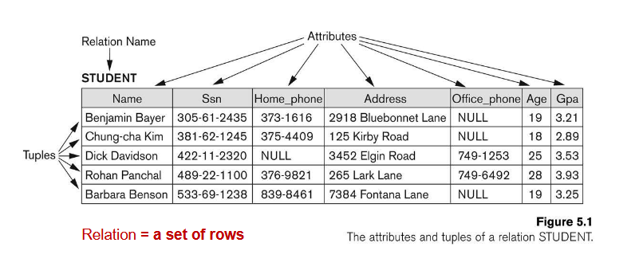
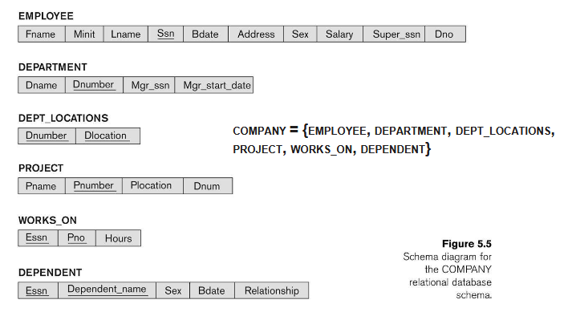
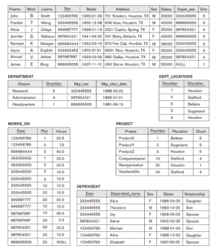

# The Relational Data Model and Relational Database Constraints

## 📌 Relational Model Concepts
### 1. ความหมายของ Relational Model
* Relational Model คือ แบบจำลองข้อมูลเชิงสัมพันธ์
* ใช้แทนข้อมูลในรูปของ ตาราง (Relations)
* แต่ละตาราง (Relation) จะประกอบด้วย แถว (Tuples) และ คอลัมน์ (Attributes)
* จุดแข็งของ Relational Model คือมี ทฤษฎีเชิงคณิตศาสตร์ของ Relation มารองรับ ⇒ ทำให้การจัดการข้อมูลเป็นระบบและตรวจสอบได้
* ในการใช้งานจริง มักใช้ผ่าน SQL ซึ่งเป็นภาษามาตรฐานสำหรับฐานข้อมูล

### 2. Informal Definitions (ความเข้าใจแบบไม่เป็นทางการ)
1. Relation = Table
    * ตารางหนึ่งใบ เช่น STUDENT, EMPLOYEE
    * ภายในมีข้อมูลเรียงเป็นแถวและคอลัมน์
2. Tuple = Row
    * 1 แถวในตาราง
    * แทนข้อมูลของวัตถุจริง ๆ เช่น

        StudentID | Name      | Age
        --------- | --------- | ---
        101       | Alice     | 20

        → แถว (101, Alice, 20) คือ Tuple

3. Attribute = Column Header
    * หัวตาราง เช่น StudentID, Name, Age
    * กำหนดชนิดของข้อมูลที่จะบันทึก

4. Key = ตัวชี้เฉพาะ
    * ค่าที่ไม่ซ้ำ ใช้ระบุ tuple แต่ละแถว
    * เช่น StudentID = 101 เป็น Key ระบุตัว Alice

### 3. Formal Definitions (ความหมายเชิงทฤษฎี)
1. Schema (โครงร่าง)
    * เขียนเป็น R(A1, A2, …, An)
    * R = ชื่อตาราง (Relation)
    * A1, A2, …, An = ชื่อ Attributes
    * เช่น `CUSTOMER(CustID, CustName, Address, Phone)`
2. Tuple (ทูเพิล)
    * เขียนเป็น `<v1, v2, …, vn>`
    * เป็นแถวข้อมูลที่ค่าของแต่ละช่องมาจาก domain ที่ถูกกำหนดไว้
    * เช่น `<632895, "John Smith", "101 Main St", "(404)894-2000">`
3. Domain (โดเมน)
    * เซตของค่าที่เป็นไปได้สำหรับ Attribute
    * เช่น
        * dom(StudentID) = {100, 101, 102, …}
        * dom(Age) = {18,19,20,21,…}
    * ทำให้มั่นใจว่าใส่ข้อมูลผิดประเภทไม่ได้ (Age ต้องเป็นตัวเลข)
4. State (สถานะของ Relation)
    * คือชุดของ Tuples ที่มีอยู่จริงในเวลาหนึ่ง
    * เช่น ตอนนี้ตาราง STUDENT มี 3 แถว
    ```
    (1, Alice, 18)
    (2, Bob, 19)
    (3, Carol, 20)
    ```
    → นี่คือ State ของ Relation STUDENT ในปัจจุบัน

### 4. Definition Summary (ตารางเปรียบเทียบ)
| Informal (เข้าใจง่าย)      | Formal (ทฤษฎี) |
| -------------------------- | -------------- |
| Table                      | Relation       |
| Column Header              | Attribute      |
| Row                        | Tuple          |
| All possible column values | Domain         |
| Table Definition           | Schema         |
| Populated Table            | State          |

### ✅ สรุป:
* Relational Model ใช้ตารางแทนข้อมูล
* Informal = ภาษาพูดที่เราใช้กัน เช่น Table, Row, Column
* Formal = ภาษาทางคณิตศาสตร์ เช่น Relation, Tuple, Attribute, Domain, State
* จุดนี้สำคัญมากเพราะเวลาศึกษาต่อไปเรื่อง Constraints และ Operations จะอ้างอิงจากคำเชิงทฤษฎีพวกนี้เสมอครับ



---

## 📌 Characteristics of Relations
### 1. Ordering of Tuples and Attributes
* Ordering of Tuples (ลำดับแถวในตาราง)
    * โดยหลักการแล้ว ลำดับของแถว (Tuples) ไม่สำคัญ
    * เช่น ตาราง STUDENT
        ``` sql
        StudentID | Name  | Age
        ----------|-------|----
        101       | Alice | 20
        102       | Bob   | 21
        ```
        
        ถ้าสลับ Bob กับ Alice ตารางก็ยังถือว่าเป็น Relation เดียวกัน
        ``` sql
        StudentID | Name  | Age
        ----------|-------|----
        102       | Bob   | 21
        101       | Alice | 20
        ```
    * ➝ เพราะ Tuple คือ “เซต” ของข้อมูล ไม่ใช่ “ลิสต์ที่เรียงลำดับ”
* Ordering of Attributes (ลำดับคอลัมน์ใน Schema)
    * ใน Schema R(A1, A2, …, An) ลำดับของ Attributes มีความสำคัญ
    * เช่น R(StudentID, Name, Age) ไม่เหมือน R(Name, Age, StudentID) (แต่ถ้าเก็บข้อมูลจริง เราแค่เปลี่ยนชื่อ header ก็เข้าใจได้)
    * เวลาเขียน Tuple `<v1, v2, v3>` ต้องสอดคล้องกับลำดับ Attribute

### 2. Atomic Values (ค่าที่แบ่งไม่ได้)
* แต่ละช่องในตาราง (แต่ละ Attribute ของ Tuple) ต้องเป็นค่า Atomic
* Atomic หมายถึง “ค่าที่ไม่สามารถแยกย่อยได้อีก”
* ตัวอย่าง:
    * ✅ Atomic → Name = "Alice"
    * ❌ ไม่ Atomic → Phone = [089-1234567, 091-7654321] (เก็บหลายค่าในช่องเดียว)
* ดังนั้น Relation ไม่อนุญาตให้เก็บข้อมูลแบบ Array หรือ List ในช่องเดียว

### 3. Null Values (ค่า Null)
* Null ใช้แทน:
    * ข้อมูลที่ ไม่รู้ (Unknown) เช่น วันเกิดยังไม่ทราบ
    * ข้อมูลที่ ไม่มี (Not available) เช่น เบอร์บ้าน (บางคนไม่มี)
    * ข้อมูลที่ ไม่เกี่ยวข้อง (Inapplicable) เช่น ค่าคอมมิชชั่นของพนักงานเงินเดือนประจำ (ไม่มี)
* ตัวอย่าง:
    ``` sql
    EmployeeID | Name   | Phone
    -----------|--------|---------
    201        | John   | 089-222-3333
    202        | Alice  | NULL
    ```
    → เบอร์ของ Alice เป็น Null (ยังไม่ทราบ หรือไม่มี)

### 4. Notation of Tuples (สัญลักษณ์การเขียน Tuple)
* Tuple t = `<v1, v2, …, vn>`
    * vi คือค่าของ Attribute Ai
* วิธีอ้างค่า:
    * `t[Ai]` = ค่าของ Attribute Ai ใน Tuple t
    * `t[emp_id]` = รหัสพนักงานของ Tuple นั้น
    * `t[emp_id, emp_name]` = Subtuple ที่เก็บแค่บาง Attribute
* ตัวอย่าง:
    ``` python
    t = <E001, John, 500000>
    ```
    * `t[emp_id] = E001`
    * `t[emp_name] = John`
    * `t[salary] = 500000`
    * `t[emp_id, emp_name] = (E001, John)`

### ✅ สรุป
1. Tuples ไม่มีลำดับ แต่ Attributes มีลำดับ
2. ทุกค่าต้องเป็น Atomic (แบ่งไม่ได้)
3. Null ใช้แทนข้อมูลที่ไม่รู้ ไม่มี หรือไม่เกี่ยวข้อง
4. มีสัญลักษณ์ `t[Ai]` ไว้อ้างค่าใน Tuple

---

## 📌 Constraints (ข้อจำกัดในฐานข้อมูลเชิงสัมพันธ์)
**Constraints** = เงื่อนไขที่กำหนดว่า “ข้อมูลใดอนุญาตให้เก็บ” และ “ข้อมูลใดไม่อนุญาตให้เก็บ”
ช่วยให้ฐานข้อมูล คงความถูกต้อง (Validity) และ ความสอดคล้อง (Consistency) อยู่เสมอ 

### 1. Inherent / Implicit Constraints (ข้อจำกัดโดยธรรมชาติของ Model)
* เป็นกฎที่เกิดขึ้นเองจาก โครงสร้างของ Relational Model
* ผู้ใช้ไม่ต้องกำหนดเอง ระบบมีให้โดยอัตโนมัติ
* ตัวอย่าง:
    * ค่าในหนึ่งช่อง (cell) ต้องเป็นค่า Atomic → ห้ามเก็บ `[1, 2, 3]` ไว้ในเซลล์เดียว
    * แต่ละ Attribute ต้องมีค่าอยู่ใน Domain ที่ถูกต้อง
    * Relation จะถูกนิยามเสมอว่าเป็น “เซตของ Tuples” → ห้ามมีแถวซ้ำ

### 2. Schema-based / Explicit Constraints (ข้อจำกัดที่กำหนดใน Schema)
* ผู้ใช้/ผู้ออกแบบฐานข้อมูลเป็นคน ระบุไว้ในโครงร่าง (Schema) โดยตรง | ผู้ใช้กำหนดเอง
* ใช้ภาษา SQL หรือ Model Specification
* ตัวอย่าง:
    * Primary Key → ห้ามมีค่าซ้ำ (Ssn ต้องไม่ซ้ำ)
    * Foreign Key → ค่าที่อ้างอิงต้องมีอยู่จริงในตารางที่อ้างถึง
    * Cardinality (Mapping) → นักศึกษา 1 คน เรียนได้หลายวิชา (1:N) แต่ละวิชาอาจมีนักศึกษาหลายคน
    * NOT NULL → กำหนดว่า Attribute นี้ห้ามเป็นค่า Null

### 3. Application-based / Semantic Constraints (ข้อจำกัดเชิงความหมายของระบบ)
* เป็นกฎที่ เกินกว่าความสามารถของ Relational Model เอง
* ต้องเขียนเพิ่มในโปรแกรมประยุกต์ หรือใช้กลไกเสริม (เช่น Trigger, Assertion)
* ตัวอย่าง:
    * ในระบบลงทะเบียนเรียน:
        * นักศึกษา 1 คน ลงทะเบียนได้ไม่เกิน 25 หน่วยกิต/ภาคการศึกษา
    * ในระบบเงินเดือน:
        * พนักงานต้องมีอายุ ≥ 18 ปี
    * ในระบบโรงพยาบาล:
        * คนไข้ที่เข้ารับการผ่าตัด ต้องมี แพทย์เวร กำกับเสมอ

### ✅ สรุปเปรียบเทียบ
| ประเภท                           | ใครกำหนด                                 | ตัวอย่าง                                                                 |
| -------------------------------- | ---------------------------------------- | ------------------------------------------------------------------------ |
| **Inherent / Implicit**          | เกิดขึ้นเองตามโครงสร้าง Relational Model | 1 cell = 1 ค่า (Atomic), ไม่มี Tuple ซ้ำ                                 |
| **Schema-based / Explicit**      | กำหนดใน Schema (SQL, Model)              | Primary Key, Foreign Key, NOT NULL, 1\:N Relationship                    |
| **Application-based / Semantic** | กำหนดโดยโปรแกรม/ธุรกิจ                   | นักศึกษา ≤ 25 หน่วยกิต, อายุ ≥ 18 ปี, จำนวนชั่วโมงทำงาน ≤ 56 ชม./สัปดาห์ |

👉 ตรงนี้สำคัญมาก เพราะ Constraints จะเป็น “กฎ” ที่ป้องกันข้อมูลไม่ถูกต้องไหลเข้า DB

---

## 📌 Relational Integrity Constraints
Constraints ที่เป็น Schema-based → ถูกกำหนดไว้ในโครงสร้างตาราง (Schema) เพื่อให้ทุก State ของ Database ถูกต้องเสมอ 

### 1. Domain Constraints (ข้อจำกัดของโดเมน)
* ทุกค่าในคอลัมน์ต้องมาจาก Domain ที่กำหนด
* Domain = เซตของค่าที่เป็นไปได้
* ตัวอย่าง:
    * `Age INT CHECK (Age >= 0 AND Age <= 120)`
    * `Phone CHAR(10)` → ต้องมี 10 หลัก
    * `BirthDate DATE` → ต้องอยู่ในรูปแบบวันที่

👉 ถ้าใส่ค่า ผิด Domain เช่น Age = "Hello" → Invalid

### 2. Key Constraints (ข้อจำกัดของคีย์)
**🔹 Superkey**
* ชุดของ Attributes ที่สามารถแยก Tuple แต่ละตัวออกจากกันได้
* อาจมีส่วนเกินก็ได้
* เช่น {Ssn, Name} ก็ยังถือว่าเป็น Superkey

**🔹 Candidate Key**
* Superkey ที่ “ไม่มี Attribute ส่วนเกิน”
* เป็น “คีย์ที่แท้จริง” ที่ใช้ระบุ Tuple
* 1 ตารางอาจมีหลาย Candidate Keys

**🔹 Primary Key**
* เลือก Candidate Key มา 1 อันเป็น “ตัวแทน”
* ห้าม Null, ห้ามซ้ำ
* ใช้เป็น ตัวตนของ Tuple

**ตัวอย่าง:**
``` sql
STUDENT(StudentID, Ssn, Name, Age)  
- Superkey: {StudentID, Name}, {Ssn, Name}, {StudentID}  
- Candidate Key: {StudentID}, {Ssn}  
- Primary Key: {StudentID}  
```

### 3. Entity Integrity (ความถูกต้องของเอนทิตี)
* Primary Key ห้ามเป็น Null
* เพราะ Primary Key ต้องใช้ระบุตัวตนของ Tuple
* ถ้า Null → แปลว่าเราระบุตัวตนไม่ได้

**ตัวอย่างผิด:**
``` sql
EMPLOYEE(Eid, Name)  
Insert (NULL, "Alice") → ❌ ผิด Entity Integrity  
```

### 4. Referential Integrity (Foreign Key)
* ใช้สร้างความสัมพันธ์ระหว่าง ตารางลูก (Referencing relation) กับ ตารางแม่ (Referenced relation)
* Foreign Key (FK) ใน R1 ต้องอ้างอิงไปยัง Primary Key (PK) ของ R2
* เงื่อนไข:
    * ค่า FK ต้องเป็นค่า PK ที่มีอยู่จริงใน R2 หรือ
    * ค่า FK = NULL (ถ้าอนุญาต)

**ตัวอย่าง:**
``` sql
EMPLOYEE(Eid, Dno)  
DEPARTMENT(Dno, Dname)  

Dno ใน EMPLOYEE = Foreign Key  
ต้องมีค่าอยู่ใน DEPARTMENT.Dno  
```
ถ้าใส่ Dno = 99 แต่ไม่มี DEPARTMENT 99 → ❌ ผิด Referential Integrity

### 5. Semantic Integrity Constraints (ข้อจำกัดเชิงความหมาย)
* เป็นกฎที่ ฐานข้อมูลมาตรฐานบังคับไม่ได้ → ต้องกำหนดเพิ่มเองด้วย Application / Trigger
* ตัวอย่าง:
    * ชั่วโมงทำงานของพนักงาน ≤ 56 ชั่วโมง/สัปดาห์
    * นักศึกษา 1 คน ลงทะเบียนได้ไม่เกิน 25 หน่วยกิต
    * ราคาโปรโมชั่นต้องไม่ติดลบ

### ✅ สรุปเปรียบเทียบ
| Constraint                | หน้าที่                     | ตัวอย่าง                             |
| ------------------------- | --------------------------- | ------------------------------------ |
| **Domain**                | บังคับค่าต้องอยู่ใน Domain  | Age ≥ 0, Phone = 10 digits           |
| **Key**                   | ระบุ Tuple ไม่ให้ซ้ำ        | Primary Key = StudentID              |
| **Entity Integrity**      | PK ห้าม Null                | Eid ≠ NULL                           |
| **Referential Integrity** | FK ต้องอ้างถึง PK ที่มีจริง | Employee.Dno ต้องมีใน Department.Dno |
| **Semantic Integrity**    | กฎทางธุรกิจ                 | นักศึกษา ≤ 25 หน่วยกิต               |

👉 ส่วนนี้คือกฎที่ทำให้ DBMS “ฉลาด” ไม่ยอมให้ข้อมูลผิดกติกาหลุดเข้ามา

## 📌 Relational Database Schema and State
### 1. Relational Database Schema (สคีมาของฐานข้อมูล)
* Schema = โครงสร้าง/พิมพ์เขียว (Blueprint) ของฐานข้อมูล
* ระบุว่า Database มี Relation (ตาราง) อะไรบ้าง และแต่ละ Relation มี Attributes อะไร พร้อม Constraints อะไร
* เขียนได้เป็นเซต:
    ``` sql
    S = {R1, R2, …, Rn} + IC
    ```
    * R1, R2, …, Rn = Relation schemas
    * IC = Integrity Constraints (เช่น Primary Key, Foreign Key, Domain constraints)

👉 Schema คือ “โครงสร้าง” ไม่ใช่ข้อมูลจริง

### 2. COMPANY Database Schema Example 

✦ จุดสำคัญ:
* มี Primary Key ในแต่ละ Relation
* มี Foreign Key เพื่อเชื่อมกัน เช่น EMPLOYEE.Dno → DEPARTMENT.Dnumber

### 3. Relational Database State (Snapshot / Instance)
* State = สถานะของ Database ณ เวลาใดเวลาหนึ่ง
* คือข้อมูลจริง (Tuples) ที่บันทึกอยู่ใน Relations ตาม Schema ที่กำหนด
* เขียนได้ว่า:
    ``` sql
    DB = {r1, r2, …, rn}
    ```
    * ri = State ของ Relation Ri
* ถ้า DB ไม่ทำตาม Constraints → Invalid state
**ตัวอย่าง:**
Schema: `EMPLOYEE(Eid, Name, Salary, Dno)`
**State:**
    ``` sql
    Eid  | Name   | Salary | Dno
    -----|--------|--------|----
    1    | Alice  | 25000  | 5
    2    | Bob    | 30000  | 5
    3    | Carol  | 40000  | 4
    ```
    นี่คือ Snapshot ของ Relation EMPLOYEE ตอนนี้

### 4. Populated Database State
* เมื่อเราเติมข้อมูลลงทุกตาราง → ได้ Database State ที่สมบูรณ์
* การเปลี่ยนแปลงข้อมูล (Insert, Delete, Update) → ทำให้เกิด State ใหม่
* ถ้าผิด Constraints → Invalid state
**ตัวอย่าง COMPANY DB:**
    * EMPLOYEE มี 5 แถว (Tuples)
    * DEPARTMENT มี 3 แถว
    * PROJECT มี 4 แถว
    * … รวมกัน = Database State หนึ่ง

ทุกครั้งที่มีการ Insert/Delete/Update → Database State เปลี่ยน



### ✅ สรุป
| แนวคิด                          | ความหมาย                                              |
| ------------------------------- | ----------------------------------------------------- |
| **Schema**                      | โครงสร้างตาราง + Attribute + Constraints (พิมพ์เขียว) |
| **Database Schema**             | เซตของ Relation schemas ทั้งหมดใน DB                  |
| **State / Snapshot / Instance** | ข้อมูลจริงที่บันทึกอยู่ใน DB ณ เวลาหนึ่ง              |
| **Populated Database State**    | สถานะจริงของ DB เมื่อมีข้อมูลในทุกตาราง               |

👉 ตรงนี้ Schema = โครงสร้างคงที่ ส่วน State = ข้อมูลที่เปลี่ยนแปลงได้

---

## 📌 Update Operations and Constraint Violations
### 1. Update Operations (การแก้ไขข้อมูลหลักใน Relation)
มี 3 คำสั่งหลักที่เปลี่ยน State ของฐานข้อมูล:
1. INSERT → เพิ่ม Tuple ใหม่
    * เช่น เพิ่มพนักงานใหม่เข้า EMPLOYEE
2. DELETE → ลบ Tuple ออกจาก Relation
    * เช่น ลบพนักงานที่ลาออก
3. MODIFY (UPDATE) → แก้ไขค่า Attribute ของ Tuple
    * เช่น เปลี่ยนแผนกของพนักงาน หรืออัปเดตเงินเดือน

### 2. Integrity Violation Handling (การจัดการเมื่อผิด Constraint)
ถ้า Operation ทำให้ผิด Constraint → DBMS ต้องแก้ไขตามวิธีที่ออกแบบไว้
* RESTRICT (หรือ REJECT) → ปฏิเสธการทำงานเลย
* CASCADE → ทำงานต่อ และบังคับแก้ไข Tuple อื่น ๆ ให้สอดคล้อง เช่น ถ้าลบ DEPARTMENT → ลบ EMPLOYEE ที่อ้างถึงด้วย
* SET NULL → ถ้าข้อมูลที่อ้างถึงถูกลบ → FK จะถูกเซตเป็น NULL
* Trigger/Error routine → ใช้โปรแกรมเสริมกำหนดกฎพิเศษเอง

### 3. Possible Violations (ความผิดพลาดที่อาจเกิด)
**🔹 3.1 Domain Constraint Violation**
* ใส่ค่าที่ไม่ตรง Domain ของ Attribute
* ❌ ตัวอย่าง: Age = "Hello" (ต้องเป็นเลข)

**🔹 3.2 Key Constraint Violation**
* ใส่ Tuple ใหม่ที่ Key ซ้ำกับของเดิม
* ❌ ตัวอย่าง: มี EMPLOYEE.Ssn = 123456789 อยู่แล้ว แต่ Insert อีกแถวที่ Ssn เท่ากัน

**🔹 3.3 Referential Integrity Violation**
* ใส่ Foreign Key ที่ไม่มีค่าในตารางอ้างอิง
* ❌ ตัวอย่าง: EMPLOYEE.Dno = 99 แต่ไม่มี DEPARTMENT.Dnumber = 99

**🔹 3.4 Entity Integrity Violation**
* Primary Key ของ Tuple ใหม่ = NULL
* ❌ ตัวอย่าง: Insert EMPLOYEE โดยไม่ใส่ Ssn (Primary Key)

### 4. ตัวอย่างสั้น ๆ
**INSERT ผิด Domain**
``` sql
Insert into EMPLOYEE(Eid, Name, Salary, Dno)  
Values (10, "Alice", "Hello", 5);  -- ❌ Salary ต้องเป็นตัวเลข
```

**INSERT ผิด Key**
``` sql
Insert into EMPLOYEE(Eid, Name, Salary, Dno)  
Values (1, "Bob", 25000, 4);  -- ❌ Eid=1 มีอยู่แล้ว
```

**INSERT ผิด Referential Integrity**
``` sql
Insert into EMPLOYEE(Eid, Name, Salary, Dno)  
Values (5, "Carol", 30000, 99);  -- ❌ Dno=99 ไม่มีใน DEPARTMENT
```

**INSERT ผิด Entity Integrity**
``` sql
Insert into EMPLOYEE(Eid, Name, Salary, Dno)  
Values (NULL, "David", 28000, 2);  -- ❌ Eid เป็น Primary Key ห้าม NULL
```

### ✅ สรุป
| Operation  | ความเสี่ยงผิด Constraint                                             |
| ---------- | -------------------------------------------------------------------- |
| **INSERT** | อาจผิด Domain, Key, Referential, Entity Integrity                    |
| **DELETE** | อาจผิด Referential (เพราะลบ PK ที่มี FK อ้างถึง)                     |
| **MODIFY** | อาจผิด Domain, NOT NULL, Referential (ถ้าแก้ FK), Entity (ถ้าแก้ PK) |

* DBMS มีวิธีจัดการ: RESTRICT, CASCADE, SET NULL, Trigger
* จุดสำคัญ: Update ทุกครั้งต้องทำให้ State ใหม่ยังคง Valid

---

## 📌 Transaction Concept
### 1. ความหมายของ Transaction
* Transaction = โปรแกรมหรือชุดคำสั่งที่ทำงานกับฐานข้อมูล โดยต้องทำให้ฐานข้อมูล อยู่ในสถานะที่ถูกต้องเสมอ
* แต่ละ Transaction อาจมีการทำงานหลายแบบ เช่น
    * Read → อ่านข้อมูล
    * Insert/Delete/Update → เปลี่ยนข้อมูล
* หลังจาก Transaction เสร็จสิ้น → DBMS ต้องมั่นใจว่าฐานข้อมูล สอดคล้องกับ Constraints

**🔹 คุณสมบัติหลักของ Transaction (ACID)**
1. Atomicity → ทำงานสำเร็จครบทุกขั้นตอน หรือยกเลิกทั้งหมด (All or Nothing)
2. Consistency → หลังจบ Transaction ฐานข้อมูลยังถูกต้อง (Valid State)
3. Isolation → Transaction แต่ละอันทำงานแยกกัน ไม่รบกวนกัน
4. Durability → ผลลัพธ์ที่ Commit แล้วจะถูกเก็บถาวร (ไม่หายแม้ระบบล่ม)

### 2. ตัวอย่าง: Bank Withdrawal Scenario 
**สถานการณ์:**
ผู้ใช้ต้องการถอนเงิน $500 จากบัญชีของตน

**ขั้นตอนการทำงาน (Transaction):**
1. Read → อ่านยอดเงินปัจจุบันในบัญชี เช่น $2000
2. Check → ตรวจสอบว่ายอดเงินพอหรือไม่
    * ถ้า Balance < 500 → Transaction ล้มเหลว (Rollback)
3. Update → หักเงินออกจากบัญชี (Balance = Balance – 500 = 1500)
4. Log → บันทึกประวัติการทำธุรกรรม (เพื่อกู้คืนได้ถ้ามีปัญหา)
5. Commit → ยืนยันการเปลี่ยนแปลง

**ผลลัพธ์:**
* ✅ Success → Balance ถูกอัปเดตเป็น $1500
* ❌ Failure → Balance กลับไปเป็น $2000 (ไม่มีการหักเงิน เพราะ Rollback)

### 3. ตัวอย่าง SQL (Pseudo-code)
``` sql
BEGIN TRANSACTION;

UPDATE Account
SET Balance = Balance - 500
WHERE AccID = 12345
AND Balance >= 500;

IF @@ROWCOUNT = 0
    ROLLBACK;  -- ถอนเงินไม่ได้ (ยอดไม่พอ)
ELSE
    COMMIT;    -- ถอนเงินสำเร็จ
```

### ✅ สรุป
* Transaction = กลุ่มของงานที่ DB ต้องทำให้สำเร็จทั้งหมด หรือไม่ทำเลย
* ทำให้ DB อยู่ใน Consistent State เสมอ
* ตัวอย่างถอนเงิน: อ่าน → ตรวจสอบ → อัปเดต → บันทึก → ยืนยัน
* ถ้ามีข้อผิดพลาด → Rollback กลับไปยังสถานะก่อนหน้า

---

## 📌 Summary : Relational Model
### 1. Relational Model Concepts
* ข้อมูลแทนในรูป Relation (ตาราง)
* Tuple (แถว) = 1 entity หรือ record จริง ๆ
* Attribute (คอลัมน์) = คุณสมบัติของ entity
* Domain = เซตของค่าที่ Attribute นั้นสามารถมีได้
* Schema = โครงสร้างของ Relation (ชื่อ + Attribute + Domain)
* State = ค่าของ Relation ในเวลาหนึ่ง (ข้อมูลจริงในตาราง)

### 2. Relational Model Constraints
* Domain Constraints → ค่าของ Attribute ต้องมาจาก Domain ที่ถูกต้อง
* Key Constraints → ใช้ระบุ Tuple อย่างไม่ซ้ำ (Superkey, Candidate key, Primary key)
* Entity Integrity → Primary Key ห้ามเป็น NULL
* Referential Integrity → Foreign Key ต้องอ้างถึง Primary Key ที่มีอยู่จริง หรือเป็น NULL ได้
* Semantic Integrity → กฎเชิงธุรกิจ เช่น นักศึกษา ≤ 25 หน่วยกิต

### 3. Relational Database Schemas
* Schema = พิมพ์เขียวของฐานข้อมูล (Relations + Attributes + Constraints)
* COMPANY DB Example: EMPLOYEE, DEPARTMENT, PROJECT, WORKS_ON, DEPENDENT ฯลฯ
* Database State (Snapshot/Instance) = ค่าข้อมูลจริงในแต่ละ Relation ขณะหนึ่ง
* Schema → คงที่, State → เปลี่ยนแปลงได้ตามการ Insert/Delete/Update

### 4. Update Operations and Constraint Violations
* Operations
    * INSERT → เพิ่ม Tuple ใหม่
    * DELETE → ลบ Tuple
    * MODIFY/UPDATE → แก้ไขค่าใน Tuple
* Violations ที่อาจเกิดขึ้น:
    * Domain Violation → ใส่ค่าผิดชนิด/เกินขอบเขต
    * Key Violation → ใส่ข้อมูลที่ซ้ำกับ Primary Key
    * Entity Integrity Violation → Primary Key = NULL
    * Referential Integrity Violation → Foreign Key ไม่มีค่าในตารางที่อ้างถึง
* Handling
    * RESTRICT (REJECT) → ปฏิเสธการทำงาน
    * CASCADE → ลบ/อัปเดตตามไปด้วย
    * SET NULL → ตั้งค่า FK เป็น NULL
    * Trigger/Error routine → ใช้กฎเฉพาะกิจ

### ✅ สรุปสั้นที่สุด
* Concepts: Table, Row, Column → Relation, Tuple, Attribute
* Constraints: Domain, Key, Entity Integrity, Referential Integrity, Semantic
* Schemas: โครงสร้าง DB = Relations + Attributes + Constraints
* Operations: Insert/Delete/Update ต้องไม่ทำผิด Constraints